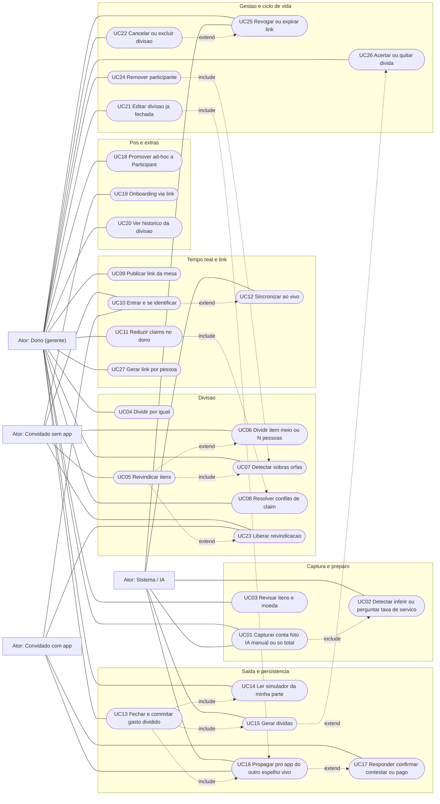
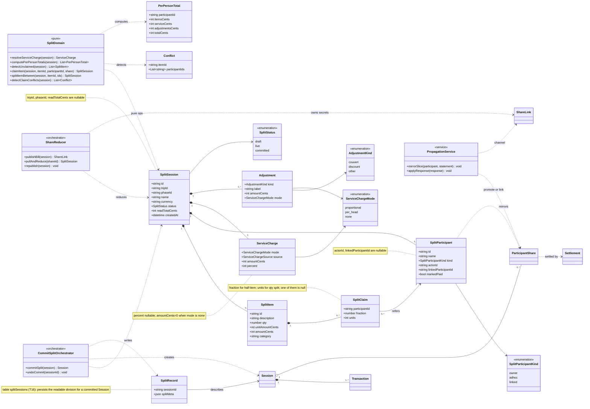
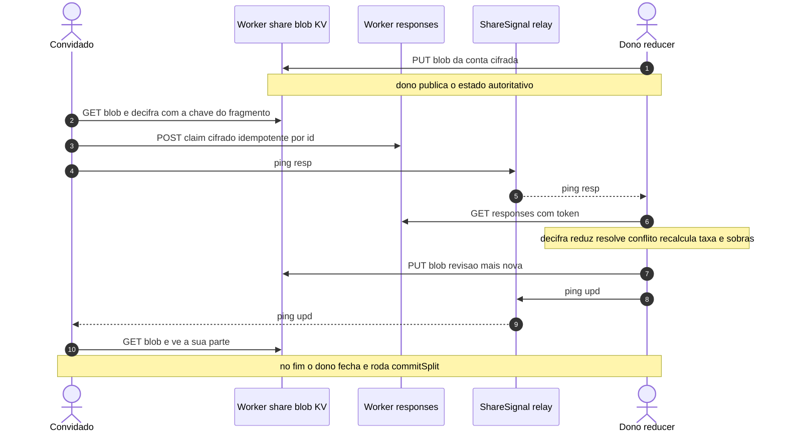

# "Dividir Conta" — Documento de Suporte à Implementação (build-ready)

> Arquivo de suporte completo e detalhado para implantação. Solicitado por Julio (2026-06-18, 2ª rodada).
> Companheiro do brainstorm `bill-split-feature-brainstorm-and-council-2026-06-18.md` (lá ficam ranking, personas e análise competitiva; aqui ficam **decisões travadas + arquitetura + gates + ACs**).
> Idioma: PT. Código (identificadores/comentários): EN. Política de verificação: §18.
> Status: **decisões TRAVADAS pelo Julio**; pronto para virar pacote `/deliver` quando ele pedir.
> Modelo de entrega desejado: **um épico só, autônomo, com testes + build + Playwright + commits + deploys Cloudflare entre etapas** (como o Budget Model Reform). Web/OTA onde der; APK só se precisar.

---

## 0. Como usar este documento

1. Leia a **§2 (decisões travadas)** — é a lei.
2. Leia a **§3 (o que já existe)** — 70% está pronto; não reinvente.
3. Os **§4 conselhos** sobre a camada nova (tempo real / persistência / naming) justificam a arquitetura.
4. **§5–§15** = spec build-ready (arquitetura, domínio, dados, sync, taxa, fluxos, gates, ACs, testes, i18n).
5. **§16** = feature futura (dados de pagamento). **§17** = riscos. **§19** = o que ainda falta o Julio decidir.

---

## 1. A visão em uma frase

> **"Passa a nota": tiro a foto, em segundos cada um sabe (e paga) a sua parte — com a taxa de serviço já rateada — e tudo isso fica salvo como um gasto dividido meu, com dívidas e leitura de orçamento, propagando pro app de quem também usa o TripPilot.**

Rápido no momento (UX ágil), **rico depois** (histórico, dívidas, orçamento). É a fusão de "calculadora de mesa" (velocidade) + "copiloto de orçamento" (o DNA do app) + "ledger leve" (quem me deve).

---

## 2. Decisões TRAVADAS (Julio, 2026-06-18) — a lei deste épico

| # | Decisão | Detalhe |
|---|---|---|
| **T1** | **Não é efêmero — persiste rico.** | Ao fechar, vira **um gasto dividido** na minha página de gastos: dá pra abrir e ver **todos os itens, quem participou, quem pagou o quê, quando dividimos, o histórico da divisão**. Gera **dívidas** (quem me deve / eu devo). Alimenta **orçamento/aprendizado**. O "efêmero" é só a **agilidade do momento**, não o ciclo de vida do dado. |
| **T2** | **Feature = "Dividir conta"** (FAB). | "Nota" como função isolada **sai**. Escanear é **input** dentro de "Dividir conta" (e dentro do registro de gasto normal, como foto). Gasto pessoal que veio de uma nota = **gasto normal com foto**, não uma feature à parte. |
| **T3** | **Taxa de serviço: proporcional + detecção ativa.** | Default **proporcional ao consumo** (alterna p/ por cabeça). A **IA procura a taxa na nota** e traz como **campo explícito**. Se não achar: **infere se já está inclusa** (total vs soma). Se realmente não houver: **pergunta** ("essa conta tem taxa de serviço a adicionar? quanto/%?"). |
| **T4** | **Claim ao vivo = V1.** | O link único multi-celular ao vivo entra **já no V1** (não é V2). |
| **T5** | **Pessoas ad-hoc, com opção de promover.** | Nomes leves por padrão (não poluem o roster). **Posso escolher** adicioná-los como `Participant`s reais — inclusive **ligar à conta do app deles** se tiverem — para uso futuro. |
| **T6** | **Pix "copiar" descartado agora → vira feature futura.** | Não dá pra "gerar um Pix" (cada banco tem o seu). **Futuro (§16):** o usuário guarda os **próprios dados de pagamento** (chave Pix, tag Wise, conta bancária); quem deve vê como pagar, escolhe o método e **anexa o comprovante** pra eu confirmar. |
| **T7** | **Mecânica de entrada = 3 modos sobre 1 verdade.** | (a) **passa-o-celular** (offline, sequencial); (b) **um link único** que todos abrem, **se adicionam** (nome) e **reivindicam** ao vivo; (c) **híbrido** (alguns no link, alguns no meu celular) **ao mesmo tempo**. **O dono é o gerente / fonte da verdade**; o celular dele detecta sobras e fecha. |
| **T8** | **Cai no app de quem tem o TripPilot — espelho VIVO bidirecional.** | Se o participante já usa o app, a divisão **entra no app dele como um gasto dele**. **Two-way (escolha do Julio):** não é snapshot congelado — o app dele **reflete ao vivo** se eu editar a divisão, e ele pode **responder de volta** (confirmar / contestar / "já paguei" + comprovante). Para não divergir a verdade financeira, segue o padrão DEC-106: **eu (dono) continuo a fonte da verdade do split; o espelho dele é vivo + canal de resposta** (não é merge CRUD livre). |
| **T13** | **Entrada do convidado é dependente do estado.** | (1) **Identidade primeiro:** sem conta → pede o nome; com app → pega o nome automático. (2) **Ramifica pelo estado:** conta **fechada** (committed) → mostra **a parte dela** direto (read-only); conta **em divisão** + modo "cada um pega o seu" + ela **ainda não escolheu** → tela de **escolher os itens dela**; já escolheu / modo por-igual → mostra a parte dela ao vivo. "Ver conta toda" = opt-in. |
| **T9** | **Link = porta de entrada.** | A página do link (sem app) oferece **"gostou? comece sua viagem"** → upgrade signup-less existente. |
| **T10** | **Um link único self-add (primário) + link por pessoa (opção).** | Primário: **um** link no grupo do WhatsApp; cada um entra, se identifica, pega a sua parte. Opção: o dono pré-monta tudo e gera **um link por pessoa** com a fatia pronta. |
| **T11** | **Ledger opt-in continua.** | "Paguei X pela fulana e ela não me pagou" → gera **dívida** dela pra mim (reusa `resolvePayerExpense` "outro/eu paguei"). |
| **T12** | **Entregar como épico autônomo** com testes/build/Playwright/commits/deploys entre etapas, quando o Julio pedir. |

---

## 3. O que JÁ existe (reusar, não reinventar) — o mapa de ativos

| Ativo | Onde | Reuso nesta feature |
|---|---|---|
| Scan IA de nota | `features/receipt/ReceiptScanPage.tsx`, `utils/ai-ocr.ts`, Worker `/ocr` (Groq `llama-4-scout`) | **Input** da "Dividir conta". Estender o **prompt** para extrair taxa de serviço (T3). |
| Parser/normalização | `domain/receipt/{parse,types}.ts` (`parseReceiptResponse`, `matchItemsToReadTotal`, `reconcileReceipt`, `dominantReceiptCategory`) | Base dos itens; `matchItemsToReadTotal` já faz **rateio proporcional exato ao centavo** (motor da taxa proporcional). |
| Motor de split/dívida | `domain/splitting/splitting.ts` (`resolvePayerExpense` DEC-114, `createEqualShares`, `buildSharesWithPayer`, `calculateDebts`, `suggestSimplifiedSettlements`, `buildParticipantStatement`, `collectSplitNotifyTargets`) | A matemática de quem-deve-quanto, acerto e extrato — **pronta**. |
| Commit como Saída | `domain/orchestrators/receipt-orchestrators.ts` (`commitReceipt`/`undoReceiptCommit`) | Molde do `commitSplit` (Session + N Transaction + shares + foto, atômico, com undo). |
| **Link E2E + canal de respostas** | Worker `worker/src/index.ts`: `POST /share` (cria `{id, writeToken}`), `GET/PUT/DELETE /share/:id` (blob ciphertext), **`POST /share/:id/responses` (convidado anexa, SEM token, idempotente por id, até 300 itens/800KB)**, `GET /share/:id/responses` (dono puxa c/ token) | **A espinha do link ao vivo.** O blob = a conta autoritativa; as respostas = os claims dos convidados; o dono é o **reducer**. |
| **Relay tempo real multi-peer** | Worker `ShareSignal` DO: **fanout até 8 sockets**, frames ≤2KB ("go pull"), zero storage | **Já suporta N convidados.** Carrega só pings "mudou, puxe de novo". O dado fica E2E no KV. |
| Cliente de share | `data/sync/{share-signal,share-client}.ts`, `domain/orchestrators/share-link-orchestrators.ts`, `domain/sync/{share-link,share-response}.ts`, `data/repositories/share-link-repository.ts`, `domain/types/share-link.ts` | Cripto AES-GCM, build/parse de URL (`/s/:id#k=`), push/pull de statement, WS de sinal — **prontos**; generalizar de 1→N. |
| Statement espelhado | DEC-106 (`mirroredStatements`), guest signup-less, `BootGate` → "Compartilhadas comigo", upgrade "começar viagem" | Base de **T8** (cai no app do outro) e **T9** (porta de entrada). |
| Empurrão multi-pessoa | `features/shared/SplitShareNudgeSheet.tsx` + `collectSplitNotifyTargets` | "Mandar pra todos" (share sheet/WhatsApp). |
| Foto device-local | Dexie v8 `attachments` (fora do backup) | Foto da conta fica no aparelho. |
| Schema aditivo | Dexie v9; tabelas device-local sem `upgrade()` | Padrão seguro para `splitSessions`/segredos do link. |

> **Achado-chave de arquitetura:** o link ao vivo multi-celular que o Julio quer **NÃO precisa de infra nova** — o `ShareSignal` (8 sockets) + `POST /responses` (sem token, idempotente) + blob KV já permitem o padrão **"convidados propõem claims → dono reduz → dono republica a verdade"**, tudo E2E. É a generalização 1→N do que o DEC-207 já faz.

---

## 4. 🏛️ Conselhos sobre a camada nova (3 sessões, inline)

> *Rodados inline (mesmo padrão dos docs `receipt-ocr-research` §4 e `shared-link`; conforme `tech-lead-delegation.mdc` sem subagentes + custo por request). Foco: a mecânica de entrada/tempo real, a persistência/propagação e o naming — as 3 coisas novas desta rodada.*

### Conselho 6 — Mecânica de entrada & sincronização em tempo real
**Papéis:** Architect · Realtime/Distributed Engineer (custom) · Critic · Advocate.

**Architect.** Uma única entidade de domínio **`SplitSession` com `claims`**, e **três transportes** sobre ela: (1) **local** (passa-o-celular: zero rede); (2) **link ao vivo** (blob KV autoritativo + `/responses` dos convidados + pings `ShareSignal`); (3) **híbrido** (o dono reduz claims do link **e** do próprio celular na mesma verdade). Princípio inegociável: **o dono é o ÚNICO escritor do estado autoritativo** (espelha DEC-106 — "a verdade financeira nunca faz merge bidirecional"). Convidado **não escreve** estado compartilhado: ele **anexa uma proposta de claim** em `/responses` (já idempotente por id). O dono puxa, **reduz**, e **republica** (`PUT /share/:id`) a conta consolidada; `ShareSignal` avisa "puxe de novo". **Bottom line:** 1 domínio, 3 transportes, dono-reducer — tudo em endpoints que já existem.

**Realtime/Distributed Engineer (custom).** O risco clássico (multi-writer convergente) **some** porque ninguém além do dono escreve a verdade — é **CRDT-trivial por arbitragem central**. Sequência: convidado lê o blob (conta) → marca seus itens → `POST /responses {id: participantId, blob: claimsCifrados}` (idempotente: reenvio sobrescreve) → dispara ping WS. Dono: ao receber ping (ou a cada N s), `GET /responses` → decifra → **reduz** (aplica claims, resolve conflito de item de qty única, recalcula taxa proporcional e sobras) → `PUT /share/:id` (nova revisão) → ping WS → todos re-puxam e veem o próprio número. **Offline:** convidado offline → fala o número pro dono, que reivindica por ele no celular (fallback passa-o-celular); dono offline → claims ficam no KV (TTL 90d) e ele reconcilia ao reabrir. **Conflito** (2 reivindicam o mesmo item de qty 1): o dono decide (UX "dividir entre os dois?" → meio-item). **Bottom line:** robusto e simples porque a verdade é centralizada no dono; o relay só sincroniza "olha, mudou".

**Critic.** Modos de falha: **(1) dono fecha o app no meio** → sem reducer, convidados veem estado velho → mitigar: o blob KV guarda a última verdade; ao reabrir, o dono re-reduz de `/responses`. **(2) o problema do último** (sobrou item, ninguém pegou) é **social, não técnico** → o celular do dono (o reducer) tem que mostrar **"estes itens ninguém pegou"** *a qualquer momento*, não só no fim, com 1 toque pra atribuir/dividir. **(3) duplo-claim** de item único → arbitragem do dono obrigatória. **(4) privacidade:** quem tem o link vê a conta toda (o link é o segredo) — ok pra uma mesa, mas a página do convidado deve abrir em **"a sua parte"** e ter **"ver conta toda"** como toque consciente. **(5) abuso do `/responses`** (300 itens) → suficiente p/ mesa real; cap já existe. **Bottom line:** blindar reabertura do dono, sobras sempre visíveis, arbitragem de conflito e a visão default "só a minha parte".

**Advocate.** O garçom está atrás da pessoa. Métrica: **tap → nome → "você paga €X" em <15s** (padrão de mercado). No link: abrir → "quem é você?" (nome) → lista → marca → **número grande + "pagar ao garçom"**. No passa-o-celular: 1 toque por pessoa, o número aparece, passa adiante. O celular do dono é o **painel ao vivo**: quem já pegou, quem falta, quanto sobra. O **híbrido tem que mostrar UMA verdade só** no painel do dono (link + celular juntos). E **nunca travar**: se a IA/rede falhar, cai pra manual/"só o total". **Bottom line:** <15s por pessoa, painel do dono como torre de controle, degradação graciosa.

**Síntese 6:** **`SplitSession` + 3 transportes + dono-reducer** sobre `ShareSignal`+`/responses`+blob KV. Viável no que existe. Cuidados: reabertura do dono, sobras sempre visíveis, arbitragem de conflito, visão default "minha parte". **Confiança: ALTA.**

### Conselho 7 — Persistência, dívidas e "cai no app do outro"
**Papéis:** Strategist · Architect · Data/Privacy Officer (custom) · Critic.

**Strategist.** O registro rico **é** o motor de retenção + viralização: o app lembra "quem me deve", alimenta a média/aprendizado, e o convidado-com-app ganha **um gasto de verdade** → fisgado. Não-efêmero é o que separa o TripPilot de uma calculadora. **Bottom line:** persistir + propagar é o ativo estratégico, não um detalhe.

**Architect.** Ao fechar, um orquestrador **`commitSplit`** (generaliza `commitReceipt`): cria **Session** ("Jantar X") com os **itens** (transactions agrupadas, apresentadas como **um gasto só** na lista — T-Q2) + **shares** (`resolvePayerExpense`) + **dívidas** + **a minha parte** integrada ao orçamento (1 leitura de simulador). Guardar a **divisão legível** (quem pegou o quê, taxa, participantes) para o "abrir o gasto e ver tudo" → `splitMeta` (JSON) na Session **ou** tabela `splitSessions`. **Propagação (T8, two-way — escolha do Julio):** reusa statement espelhado/guest (DEC-106/207) **como espelho VIVO**: o participante linkado vê a fatia dele **atualizar quando eu edito** e pode **responder de volta** (confirmar / contestar / "já paguei"). Para não divergir, **eu sigo a fonte da verdade do split**; o espelho dele é vivo + canal de resposta (não é merge CRUD livre — é a forma "two-way" que o DEC-106 já consagra). O app dele **materializa a fatia como gasto dele** (com confirmação no preview de import, nunca silenciosa). **Bottom line:** `commitSplit` reusa tudo; a propagação é **espelho vivo bidirecional** sobre o canal E2E que já existe, com dono-autoritativo evitando divergência.

**Data/Privacy Officer (custom).** Local-first se mantém: a **verdade vive no aparelho do dono**; o KV só guarda **ciphertext E2E** com TTL; a propagação usa o mesmo canal cifrado; **sem conta central**. O import no app do outro é decifrar+inserir **no cliente**, com confirmação. Fotos seguem device-local (DEC-206). Risco PII: a conta mostra o que cada um comeu → cada fatia compartilhada expõe **só aquela pessoa** por padrão. **Bottom line:** dá pra propagar sem ferir a âncora — E2E + pull-confirmado + sem conta.

**Critic.** A propagação cross-device é a capacidade **mais arriscada** (reflete na vida financeira de outra pessoa). Two-way (escolha do Julio) **eleva o risco** — então a disciplina importa: **(1)** *não* é merge CRUD livre; é **dono-autoritativo + respostas** (DEC-106) — eu mando a fatia/dívida, ela **confirma/contesta/"paguei"**; quem ganha em conflito é sempre a fonte da verdade do split (eu). **(2)** Materializar como gasto dela exige **confirmação no preview de import** (nunca silencioso); depois disso, edições minhas chegam como **"atualização disponível"** que ela aceita (não sobrescreve a mão dela sem aviso). **(3)** Anti-dupla-contagem: **dono não importa de si mesmo**; e a fatia dela no app dela referencia a **mesma dívida** (não cria uma segunda). **(4)** Revogação: se eu apagar o split, o espelho dela vira **"o dono removeu"** (tombstone), não some sozinho. **Bottom line:** two-way = espelho vivo dono-autoritativo + respostas; blindar import confirmado, conflito (dono ganha), dupla-contagem e revogação.

**Síntese 7:** **`commitSplit`** persiste gasto dividido + dívidas + orçamento; **propagação = espelho VIVO bidirecional E2E** (T8, escolha do Julio) reusando mirrored statements DEC-106 — dono-autoritativo + canal de resposta, com import confirmado. **Confiança: MÉDIA-ALTA** (reusa DEC-106/114/207; o two-way exige cuidado extra de conflito/revogação, por isso vira foco de teste no G3).

### Conselho 8 — Naming & escopo ("nota" vs "gasto" vs "dividir conta")
**Papéis:** Strategist · Advocate · Simplifier · Critic.

**Strategist.** "Dividir conta" é o **verbo** que vende e merece o FAB; "Nota" era um **substantivo de implementação**. Dobrar o scan dentro do registro de gasto (foto em qualquer gasto já existe) está certo — scan é **input**. **Bottom line:** nomear pela ação ("Dividir conta") é posicionamento melhor.

**Advocate.** O usuário pensa "preciso **dividir essa conta**", não "preciso escanear uma nota". A porta deve dizer o que faz. Recibo pessoal de mercado é raro o bastante pra viver dentro de "gasto + foto". **Bottom line:** porta = a tarefa do usuário.

**Simplifier.** Duas portas no FAB, no máximo: **"Registrar gasto"** (com foto/scan opcional) e **"Dividir conta"** (a estrela). Mata-se "Escanear nota" como **conceito**; scan vira **método de captura** dentro das duas. **Bottom line:** menos portas, nomes por ação.

**Critic.** **Mas** "Escanear nota" já existe e foi testada/aprovada (DEC-206/209) — renomear/re-rotear **não pode quebrar** o caminho scan→Saída nem a persona 2 (mercado misto itemizado). Migração: **"Escanear nota" → "Dividir conta" (superset)**: escanear continua funcionando, **dividir vira o destaque**; o caso "tudo meu" vira o modo **"só meu"** dentro de "Dividir conta" (ou um gasto multi-item). **Bottom line:** "Dividir conta" **absorve** a tela de nota atual (superset), sem perder o que já roda.

**Síntese 8:** renomear/reposicionar a feature de nota como **"Dividir conta"** (superset que mantém scan como input e "só meu" como modo); FAB com "Registrar gasto" (+foto) e "Dividir conta". **Confiança: ALTA.**

---

## 5. Arquitetura (camadas)

```
              ┌─────────────────────────────────────────────┐
              │  "Dividir conta" (feature UI)                │
              │  captura → revisão → modo → claim → cartões  │
              │  → commit → compartilhar                      │
              └───────────────┬─────────────────────────────┘
                              │ (UI chama domínio puro + orquestradores)
        ┌─────────────────────┴───────────────────────────────┐
        ▼                                                       ▼
[domain/split/ — PURO]                          [domain/orchestrators/]
  splitSession types, claims,                     commitSplit() (Session+Tx+shares
  computePerPersonTotals,                          +debts+budget, atômico, undo)
  applyServiceCharge (proporcional/cabeça),        promoteAdhocToParticipant()
  detectUnclaimed, claim/release,                  importMySliceFromShare() (guest)
  conflict detection — TESTÁVEL
        ▲                                                       ▲
        │ reusa parse/matchItemsToReadTotal/resolvePayerExpense  │ reusa commitReceipt molde
        │                                                        │
[transportes]                                            [persistência Dexie]
  (a) local (passa-o-celular)                              Session, Transaction,
  (b) live link  ── ShareSignal (pings) ──┐                 ParticipantShare, Settlement
       blob KV (verdade) + /responses     │                 + splitSessions (draft+meta)
  (c) híbrido (a+b na mesma verdade)       │                 + shareLinks (segredos, device-local)
        ▲                                  ▼
        └───────── dono = REDUCER / fonte da verdade ──────────┘
```

**Invariantes:**
1. **Dono é o único escritor do estado autoritativo.** Convidados **propõem** (via `/responses`); o dono reduz e republica.
2. **Domínio puro não sabe de transporte nem de "vira gasto".** Cálculo é testável isoladamente.
3. **Persistir é decisão de SAÍDA** (commit), não do cálculo.
4. **E2E sempre:** chave AES no `#fragment`; KV/relay só veem ciphertext.
5. **Local-first:** verdade no aparelho do dono; nuvem é canal opt-in com TTL.

---

## 6. Modelo de domínio (`domain/split/` — puro, EN)

```ts
type SplitParticipantKind = 'owner' | 'adhoc' | 'linked';

interface SplitParticipant {
  id: string;                       // ephemeral uuid within the session
  name: string;
  kind: SplitParticipantKind;
  actorId: string | null;           // set when linked to an app user (T8)
  linkedParticipantId: string | null; // set when promoted to a real Participant (T5)
  markedPaid: boolean;              // E10 — once paid/confirmed, their slice is edit-locked
}

interface SplitClaim {
  participantId: string;
  /** Fraction of the line claimed by this person (0..1). Enables half-item. */
  fraction: number;                 // e.g. 0.5 (metade) | 1 (inteiro)
  /** When the line has qty>1: how many UNITS this person takes (alt to fraction). */
  units: number | null;
}

interface SplitItem {
  id: string;
  description: string;
  qty: number;
  unitAmountCents: number;
  amountCents: number;              // line total
  category: string;
  claims: SplitClaim[];             // empty = unclaimed (órfão)
}

type ServiceChargeMode = 'proportional' | 'per_head' | 'none';
type ServiceChargeSource = 'detected' | 'inferred_included' | 'asked' | 'manual';

interface ServiceCharge {
  mode: ServiceChargeMode;
  source: ServiceChargeSource;
  amountCents: number;              // 0 when none
  percent: number | null;          // when expressed as %
}

// E6 — non-service lines that still change what people pay.
type AdjustmentKind = 'couvert' | 'discount' | 'other';
interface Adjustment {
  kind: AdjustmentKind;
  label: string;
  amountCents: number;              // negative for discount
  mode: ServiceChargeMode;          // couvert -> per_head default; discount/other -> proportional
  source: ServiceChargeSource;
}

interface SplitSession {
  id: string;
  tripId: string | null;           // null = quick split outside a trip
  phaseId: string | null;
  name: string;                    // "Jantar no X"
  currency: string;                // E8 — the BILL's currency; converted to trip base at commit (reuses receipt FX)
  status: 'draft' | 'live' | 'committed';
  serviceCharge: ServiceCharge;
  adjustments: Adjustment[];       // E6 — couvert / discount / other (rateados por mode)
  items: SplitItem[];
  participants: SplitParticipant[];
  readTotalCents: number | null;   // printed total, for reconciliation
  createdAt: string;
}

interface PerPersonTotal {
  participantId: string;
  itemsCents: number;              // sum of their claimed slices
  serviceCents: number;            // their share of service charge
  adjustmentsCents: number;        // E6 — their share of couvert/discount/other
  totalCents: number;
  lines: { description: string; amountCents: number }[]; // for the card + link
}
```

**Funções puras (todas com testes de matemática):**
- `applyServiceCharge(session): ServiceCharge` — resolve o rateio.
- `computePerPersonTotals(session): { totals: PerPersonTotal[]; unclaimed: SplitItem[]; ownerTotal: PerPersonTotal }`
  - **proporcional:** serviço (e ajustes proporcionais) de cada um = `valor × (itemsCents_pessoa / itemsCents_somados)`; último absorve arredondamento (reusa lógica de `matchItemsToReadTotal`).
  - **por cabeça:** `valor / nº de pagantes` (default do couvert).
  - **E6 — ajustes:** aplica cada `Adjustment` pelo seu `mode` (couvert por cabeça; desconto proporcional como crédito negativo) → `adjustmentsCents`.
- `detectUnclaimed(session): SplitItem[]` — itens com `claims` vazios (o "ninguém pegou").
- `claimItem(session, itemId, participantId, {fraction|units}) / releaseClaim(...)` — imutável; **E10:** rejeita se o participante está `markedPaid` (slice travada).
- `addParticipant(session, name, identity?): SplitSession` — **E7:** nome duplicado é permitido (id é uuid), mas um device que retorna (mesmo `actorId`/token local) **re-liga ao participante existente** em vez de criar outro; nomes iguais ganham sufixo/cor estável só na exibição.
- `detectClaimConflicts(session): Conflict[]` — qty 1 reivindicado por >1 sem fração somando ≤1.
- `splitItemBetween(session, itemId, participantIds[])` — meio-item / N-avos em 1 toque.

---

## 7. Modelo de dados (Dexie) — o que persiste

| Tabela | Backup? | Conteúdo |
|---|---|---|
| `sessions`, `transactions`, `participantShares`, `settlements` (existentes) | ✅ (menos device-local) | **Resultado committed** do split (T1): a Session é o "gasto dividido"; cada item = Transaction; shares = dívidas; settlements quando acerta. |
| **`splitSessions`** (nova) | ✅ | **`splitMeta`** legível por Session committed: participantes (nomes/kind), claims por item, modo/origem da taxa, total lido — para **"abrir o gasto e ver a divisão inteira"** (T1). Também guarda o **draft `live`** em andamento. |
| **`shareLinks`** (existente, device-local) | ❌ | Segredos do link: `shareId`, `key` (AES), `writeToken`, `statementRevision`. Generalizar `participantId` → suportar **link de mesa** (sessão inteira) além de per-pessoa. |
| `attachments` (existente, device-local) | ❌ | Foto da conta. |

**Schema bump:** Dexie **v10→v11** (tabela nova `splitSessions`, padrão aditivo sem `upgrade()`). **T16 (resolvido):** `splitMeta` vive na tabela `splitSessions` (não em campo de Session), pra consultar a divisão sem carregar tudo. Backup format avança para incluir `splitSessions`.

---

## 8. Protocolo de sincronização (os 3 transportes)

### 8.1 Passa-o-celular (transporte local) — offline, V1, trivial
Sem rede, sem link. O celular do dono cicla pelas pessoas: seleciona "sou a Bianca" → marca itens → mostra número → "próximo". `detectUnclaimed` mostra sobras a qualquer momento. **Fonte da verdade local.** É o subconjunto degradado dos outros.

### 8.2 Link único ao vivo (transporte de rede) — V1 (T4)
1. **Dono cria:** `commitSplit`? **Não** — ainda é `draft`. Dono **publica a conta**: cifra o `SplitSession` (itens + estado atual) com uma chave AES nova → `POST /share {blob}` → `{shareId, writeToken}`. Guarda em `shareLinks`. Monta `…/split/:shareId#k=<key>` (novo path `/split/`, irmão de `/s/`).
2. **Compartilha UM link** no grupo (share sheet/WhatsApp) — T10 primário.
3. **Convidado abre** (web sem app, ou app) — **fluxo dependente do estado (T13):**
   - **Identidade primeiro:** sem conta → página pergunta **"quem é você?"** → nome → `SplitParticipant {kind:'adhoc'}`; com app → detecta actorId → **nome automático** (`kind:'linked'`).
   - **Ramifica pelo estado da sessão:**
     - `committed` (conta fechada) → mostra **a parte dela** direto (read-only) + "ver conta toda" opt-in.
     - `live` + modo "cada um pega o seu" + **ela ainda não escolheu** → **tela de escolher os itens dela**.
     - `live` + já escolheu, ou modo "por igual" → mostra **a parte dela ao vivo** (editável até fechar) + "ver conta toda" opt-in.
4. **Convidado decifra** o blob (chave do `#fragment`) → vê a conta → **marca seus itens** → `POST /share/:id/responses {id: participantId, blob: claimsCifrados}` (sem token, **idempotente por participante** → no máx. N respostas, longe do cap de 300 — **E9**) → abre WS `/share/:id/ws` e manda ping `{t:'resp'}` (mesa gigante: dispensa o WS, dono puxa por timer).
5. **Dono (reducer):** WS `ping` (ou poll) → `GET /share/:id/responses` (com token) → decifra claims → **reduz** na verdade (`claimItem`, resolve conflito, recalcula taxa/sobras) → `PUT /share/:id {blob}` (revisão++) → manda ping `{t:'upd'}`.
6. **Todos re-puxam** `GET /share/:id` → veem o número atualizado (a sua parte / a conta toda).
7. **Fechamento:** o dono vê **sobras** ("ninguém pegou isto") no painel; resolve (atribui/divide); então **`commitSplit`** (T1) + opcionalmente **propaga** (§11.3) + revoga o link (`DELETE`) ou deixa expirar (TTL).

> Tudo isso usa **apenas** endpoints existentes (`/share`, `/share/:id`, `/share/:id/responses`, `/share/:id/ws` via `ShareSignal` 8-sockets). **Nenhuma rota nova no Worker** — só payload/orquestração no cliente. (**T17 resolvido:** convidados não precisam manter WS aberto; POSTam o claim — idempotente por participante — e o dono puxa; mesa gigante degrada sem perder ninguém.)

### 8.3 Híbrido (T7) — link + celular do dono ao mesmo tempo
O dono também reivindica **no próprio celular** por pessoas que não abriram o link (fala "eu sou o Ricardo, peguei isto"). Esses claims entram **na mesma verdade** que os do link. O painel do dono mostra **uma lista só**. Como o dono é o reducer, isso é natural: claims locais e claims de `/responses` convergem no mesmo `SplitSession`.

---

## 9. Taxa de serviço (T3) — detecção ativa + pergunta

### 9.1 Prompt da IA (estender `OCR_PROMPT` no Worker)
Adicionar ao JSON pedido os campos **`serviceCharge`** e **`adjustments`** (E6):
```
"serviceCharge": { "amount": number|null, "percent": number|null, "included": boolean|null },
"adjustments": [ { "kind": "couvert"|"discount"|"other", "label": string, "amount": number } ]
```
Regra no prompt: *"procure serviço/gorjeta/taxa/tip/gratuity/'service' → serviceCharge (amount, percent se impresso, included=true se já no total, false se à parte); procure couvert/cover/desconto/discount e linhas que não são produtos → adjustments (amount negativo para desconto); sem menção a serviço → serviceCharge.amount=null e included=null."*

### 9.2 Lógica no cliente (pura, `resolveServiceCharge`)
1. **Achou na nota** → `source:'detected'`, `mode` default `proportional`, valor = `amount` (ou `percent × subtotal`).
2. **Não achou, mas `total − Σitens ≈ 8–15%`** → `source:'inferred_included'`; mostrar *"parece que a taxa de serviço (≈€X) já está inclusa — confirmar?"*.
3. **Não achou e `total ≈ Σitens`** (ou sem total) → **PERGUNTAR** ao trazer o resultado: *"Essa conta tem taxa de serviço a adicionar?"* → [Não] / [Sim → € ou %]. `source:'asked'`/`'manual'`.
4. **Anti-dupla-contagem:** se a IA trouxe a taxa como **item** (apesar do prompt), `detectServiceLikeItems` sinaliza e oferece **promover ao campo taxa** em vez de contar como item.
5. **E6 — ajustes (couvert/desconto/outros):** viram `Adjustment` com `mode` default (couvert → por cabeça; desconto/outros → proporcional, desconto como crédito negativo). Se a IA não trouxer mas `Σitens + serviço ≠ total`, mostrar a diferença como **linha de ajuste editável** ("couvert? desconto? outro?").

---

## 10. Os modos de divisão (fluxo do usuário)

Após captura (foto IA / manual / "só o total") → moeda → **taxa (§9)** → **"Como dividir?"**:
- **Por igual** → "quem / quantas pessoas?" (nomes ad-hoc opcionais) → cada um = `(Σitens + serviço + ajustes)/N`.
- **Cada um pega o seu** → claim (passa-o-celular / link ao vivo / híbrido); visão **Por pessoa** ou **Por item**; **meio-item** e **qty→N-donos** em 1 toque; **sobras** sempre visíveis.
- **Só meu** → tudo meu (vira 1 gasto normal; o "recibo pessoal" da persona 2).

**Saída** (sempre persiste — T1): cartão por pessoa → **`commitSplit`** → "registrar a minha parte" com **leitura de simulador** ("€27,80 cabe no teto de hoje; sobram €40") → **dívidas** dos outros → **propaga** pra quem tem o app (T8) → **compartilhar** (links).

---

## 11. Persistência, orçamento e propagação

### 11.1 `commitSplit` (orquestrador, molde do `commitReceipt`)
Transação Dexie única: Session ("gasto dividido") com os itens **agrupados como UM gasto na lista** (T-Q2: igual à nota hoje — itens ao tocar, não N linhas soltas) + `participantShares` (via `resolvePayerExpense`, DEC-114) + `splitMeta` (a divisão legível) + foto. Undo simétrico. A Session é navegável depois: **itens, quem pegou o quê, quem pagou, quando, histórico** (T1).

### 11.2 Ponte com o orçamento (o DNA — T1)
A **minha parte** vira **1 leitura de simulador** antes de confirmar (reusa DEC-116): cabe no teto de hoje? consome quantas jantas? E **entra na minha média/aprendizado**. Para participantes-com-app, o gasto deles entra na **média deles** (T8).
**E8 — moeda:** a divisão é calculada na **moeda da conta** (`SplitSession.currency`); no commit, a "minha parte" (e as dívidas) **convertem pra base da viagem** reusando o **FX do receipt**, guardando valor original + convertido — o simulador lê o convertido.

### 11.3 Propagação "cai no app do outro" (T8) — espelho VIVO bidirecional
Para `SplitParticipant kind:'linked'` (tem o app): publica a **fatia dele** no canal E2E (statement espelhado, DEC-106) → o app dele mostra **"importar como meu gasto"** (preview de import, **nunca silencioso**) → vira gasto + dívida pra mim, **no app dele**.

**Two-way (escolha do Julio), com dono-autoritativo (sem divergência):**
- **Dono → participante (downstream vivo):** se eu editar/recategorizar/recalcular a divisão, o espelho dele recebe **"atualização disponível"** (ping `ShareSignal` + re-pull do blob); ele **aceita** (não sobrescreve a mão dele em silêncio).
- **Participante → dono (upstream):** ele pode **confirmar**, **contestar** ("não pedi isso") ou **"já paguei" (+ comprovante, §16)** via `/responses`; eu vejo e concilio. A **dívida** é o objeto vivo compartilhado (um só), não uma cópia paralela.
- **Conflito:** eu (fonte da verdade do split) **ganho**; a resposta dele é proposta/contestação, não escrita direta — exatamente o padrão DEC-106.
- **Revogação:** se eu apagar o split, o espelho dele vira **"o dono removeu"** (tombstone), não some sozinho.
- **Anti-dupla-contagem:** dono **não** importa de si; a fatia no app dele referencia a **mesma** dívida.

> Honestidade de engenharia: "two-way" aqui **não** é merge CRUD livre entre dois bancos locais (isso divergiria) — é **espelho vivo + canal de resposta com dono-autoritativo**, a forma que o DEC-106 já consagrou. É o que entrega o que o Julio quer (sincroniza nos dois sentidos) sem quebrar a âncora local-first. Por elevar o risco, o two-way é **foco de teste no G3** (conflito, revogação, dupla-contagem).

### 11.4 Ledger opt-in (T11)
"Paguei pela fulana e ela não pagou" → `resolvePayerExpense` (outro/eu paguei) → **dívida** dela pra mim em `/shared`, com acerto simplificado (`suggestSimplifiedSettlements`) e extrato (`buildParticipantStatement`) — **prontos**.

### 11.5 Editar / cancelar / acertar depois (E10 + ciclo de vida)
- **Editar (UC21):** recalcula a divisão e envia "atualização disponível" pros espelhos (§11.3). **E10:** a fatia de quem já está `markedPaid` (pagou/confirmou) fica **travada**; alterar outras fatias **avisa** *"X já pagou — isto pode gerar diferença"* antes de aplicar.
- **Cancelar/excluir (UC22):** desfaz o `commitSplit` (undo) e **tombstona** os espelhos (`DELETE /share/:id` → convidado lê "o dono removeu", UC25).
- **Acertar dívida (UC26):** marca `Settlement` (reusa o acerto existente) e fecha o ciclo da dívida.

---

## 12. Os dois tipos de link (T10)

| | **Link de mesa (primário)** | **Link por pessoa (opção)** |
|---|---|---|
| Como | **UM** link no grupo; cada um entra, **se adiciona** (nome/auto), reivindica ao vivo | Dono pré-monta tudo, gera **N** links, manda a fatia pronta de cada um |
| Infra | blob KV (sessão) + `/responses` + `ShareSignal` | `/s/:id#k=` por participante (modelo DEC-207 atual) |
| Quando | mesa grande, todo mundo junto | poucas pessoas, dono já sabe quem pediu o quê |
| Página convidado | **estado-dependente (T13):** nome → (fechada: mostra a parte / em divisão e não escolheu: tela de marcar itens / já escolheu: número ao vivo) + "ver conta toda" opt-in | já abre na fatia pronta (confirma/paga) |
| Porta de entrada (T9) | "comece sua viagem" no rodapé | idem |

---

## 13. Pessoas ad-hoc + promoção (T5)
- Default: `SplitParticipant {kind:'adhoc'}` — **efêmero**, não polui `participants`/dívidas da viagem.
- Opção **"adicionar como pessoa da viagem"** → `promoteAdhocToParticipant` cria `Participant` real; se a pessoa tem o app (actorId via link), **liga** (`linkedActorId`) para usos futuros (dívidas recorrentes, próximas divisões).

---

## 14. Naming & navegação (T2/§Conselho 8)
- **FAB:** "Registrar gasto" (foto/scan opcional, já existe) · **"Dividir conta"** (a estrela, novo destaque) — substitui o card "Escanear nota" (superset).
- **Rota:** generalizar `/receipt` → `/split` (ou manter rota, mudar título/IA); a tela de nota atual vira a tela de "Dividir conta" com o **fork de modos**.
- "Só meu" cobre o recibo pessoal itemizado (persona 2). Anexar foto a um gasto comum continua no fluxo de gasto normal.

---

## 15. Plano de gates (V1 inclui o link ao vivo — T4)

> Estimativas cruas → **Tier 3 ÷3.0** (`velocity-standard.mdc`). Cada gate: testes + build + Playwright + commit + deploy (apex `--branch=master`).

| Gate | Escopo | Reusa | Novo | Esforço (cru→T3) | ACs principais |
|---|---|---|---|---|---|
| **G1 — Núcleo offline + taxa + persistência** | `domain/split` puro; captura (IA/manual/só-total); **taxa detect/inferir/perguntar**; modos igual/cada-um(passa-o-celular)/só-meu; meio-item; sobras; cartões; **`commitSplit`** (gasto dividido + dívidas) + ponte orçamento (simulador); ad-hoc | parse, `matchItemsToReadTotal`, `resolvePayerExpense`, `commitReceipt` molde, simulador | `domain/split`, fork de modos, `commitSplit`, `splitMeta`, `SplitParticipant` | ~70h→**23h** | dividir um jantar real por item, taxa proporcional certa, sobras detectadas, vira gasto navegável + dívidas + leitura de simulador; tudo offline |
| **G2 — Link de mesa ao vivo (T4/T7/T13)** | publicar conta no KV; página `/split/:id` (**entrada estado-dependente T13:** nome → marcar itens se em divisão / parte direta se fechada); claim via `/responses`; **dono-reducer**; pings `ShareSignal`; sobras ao vivo; **híbrido**; "ver conta toda" opt-in | `/share` + `/responses` + `ShareSignal`, share-client, cripto AES | orquestração reducer, payload de sessão, página convidado estado-dependente | ~80h→**27h** | 1 link no grupo; convidado novo entra → pede nome → cai na tela certa pelo estado; 3 reivindicam ao vivo; painel do dono reflete em <2s; sobras corretas; dono fecha e commita |
| **G3 — Propagação two-way + onboarding + link por pessoa** | **espelho vivo bidirecional (T8):** cai no app do outro + atualização downstream + respostas upstream (confirmar/contestar/pago) + conflito dono-ganha + revogação/tombstone + anti-dupla-contagem; porta "comece sua viagem" (T9); link por pessoa (T10 opção); promover ad-hoc→Participant/conta (T5) | mirrored statements (DEC-106), guest/upgrade (DEC-207), `SplitShareNudgeSheet`, `/responses` | import guest-side vivo, sync downstream, respostas upstream, promoção | ~60h→**20h** | participante-com-app importa a fatia (confirmado) e ela **atualiza quando o dono edita**; ele contesta/marca-pago e o dono vê; apagar o split tombstona o espelho; sem dupla-contagem; convidado sem app vê "começar viagem" |
| **G4 — (FUTURO) Dados de pagamento** | §16 — conta de pagamento do usuário + escolher método + anexar comprovante | attachments, shared link | página de dados de pagamento, fluxo de comprovante | ~35h→**12h** | quem deve vê meu Pix/Wise, paga, anexa comprovante; eu confirmo |

**V1 = G1+G2+G3 ≈ 70h Tier 3 (~2 semanas).** (Subiu de ~61h porque o two-way de propagação — escolha do Julio — pesa mais que o snapshot.) G4 = épico futuro separado.

**Testes (por `test-routing.mdc`):** unit (Vitest) para todo `domain/split` (taxa proporcional/por-cabeça com números reais, sobras, meio-item, qty-split, conflito, `computePerPersonTotals` bate centavo a centavo); orquestrador `commitSplit`/undo; **two-way (G3): conflito dono-ganha, revogação→tombstone, anti-dupla-contagem, downstream "aceitar atualização"**; Playwright (criar split, dividir por item, link de mesa com 2 contextos de browser — convidado novo cai na tela certa pelo estado e reivindica ao vivo, sobras, commit→gasto navegável; um 2º contexto "com app" recebe a fatia, contesta, vê atualização downstream). i18n ×3 (pt-BR/en/es) para toda string.

---

## 16. Funcionalidade FUTURA (T6) — Dados de pagamento + comprovante
> Não é V1. Documentado para virar épico depois ("muito boa mesmo" — Julio).

- O usuário guarda os **próprios dados de pagamento**: chave **Pix**, tag **Wise**, conta bancária, ou texto livre ("me paga no X").
- Quando alguém me deve (via link/ledger), a fatia dele mostra **como me pagar** (meus dados), com botão **copiar**.
- A pessoa escolhe o método, paga **fora do app** (cada banco é cada banco), e **anexa um comprovante** (foto) que volta pra mim via o canal E2E (responses/mailbox).
- Eu vejo "Bianca anexou comprovante — confirmar recebido?" → marca a dívida como paga.
- Reusa: attachments, shared link/responses, settlement. **Privacidade:** meus dados de pagamento são meus, ficam no meu device e só viajam cifrados pra quem me deve.

---

## 17. Riscos & mitigações

| Risco | Sev. | Mitigação |
|---|---|---|
| Dupla contagem da taxa (item + campo) | ALTA | `detectServiceLikeItems` + prompt manda não listar serviço como item + reconciliação |
| Dono fecha o app no meio do live | MÉDIA | blob KV guarda a verdade; reduz de `/responses` ao reabrir |
| Problema do último (sobra órfã) | MÉDIA | sobras **sempre visíveis** no painel do dono, não só no fim; 1 toque pra atribuir/dividir |
| Conflito de claim (item único) | MÉDIA | dono arbitra; UX "dividir entre vocês?" → meio-item |
| Propagação two-way diverge / sobrescreve / conta dobrado | **ALTA** | dono-autoritativo (DEC-106, dono ganha conflito); import **confirmado** (preview); atualização downstream = "aceitar", não sobrescrever; dívida é objeto único (dono não importa de si); revogar = tombstone. **Foco de teste no G3.** |
| 8 sockets do `ShareSignal` vs mesa grande (E9) | BAIXA | convidado não precisa manter WS; POSTa claim (idempotente por participante → no máx. N respostas, longe do cap 300); dono puxa por timer; poll de fallback |
| Desconto/couvert contado errado (E6) | MÉDIA | `Adjustment` dedicado, rateado por `mode` (couvert por cabeça, desconto proporcional negativo); IA extrai e reconcilia `Σitens+serviço+ajustes = total` |
| Editar depois de alguém pagar (E10) | MÉDIA | fatia `markedPaid` travada; alterar outras avisa "X já pagou"; cancelar = undo + tombstone |
| Moeda da conta ≠ viagem (E8) | BAIXA | calcula na moeda da conta; converte a minha parte no commit (FX do receipt); guarda original + convertido |
| Privacidade (link expõe a conta toda) | MÉDIA | default "só a minha parte"; "ver conta toda" é toque consciente; E2E |
| Sem rede / IA falha | BAIXA | manual / "só o total" / passa-o-celular sempre funcionam offline |
| Quebrar a feature de nota existente | MÉDIA | "Dividir conta" é **superset**; caminho scan→Saída e "só meu" preservados |

---

## 18. Fontes & verificação
- **Infra interna (leitura direta 2026-06-18):** `worker/src/index.ts` (`ShareSignal` fanout 8 sockets; `/share` + `/share/:id/responses` sem-token idempotente; `/ocr` Groq), `domain/types/share-link.ts`, `domain/sync/share-link.ts`, `domain/splitting/splitting.ts`, `domain/receipt/{parse,types}.ts`, `domain/orchestrators/receipt-orchestrators.ts`, `features/receipt/ReceiptScanPage.tsx`, `features/shared/SplitShareNudgeSheet.tsx`. *(VERIFIED)*
- **Mercado (VERIFIED 2026-06-18, ver brainstorm §16):** rateio **proporcional** de taxa/gorjeta é o padrão (SplitEven/ReceiptSplit/Supasplit); **claim ao vivo, um QR, sem app, todos os celulares em sync** existe (TabSettle/Settl/me&u) **mas via PDV do restaurante** — a versão **foto/offline + orçamento + grátis/sem-login** é o espaço do TripPilot.
- **Decisões internas relacionadas:** DEC-106 (mirrored statements), DEC-114 (`resolvePayerExpense`), DEC-206/208/209 (receipt/scan), DEC-207 (shared link E2E + S7 real-time).

---

## 19. Decisões — resolvidas nesta rodada + ainda em aberto

**Resolvidas (Julio, 2026-06-18):**
- ✅ **Q2 — Forma do gasto:** **um gasto só** "Jantar X" com itens dentro (igual à nota hoje). → §11.1.
- ✅ **Q5 — Página do convidado:** **estado-dependente (T13)** — nome → (fechada: a parte / em divisão sem escolher: marcar itens / já escolheu: número ao vivo); "ver conta toda" opt-in. → §8.2, §12.
- ✅ **Q6 — Propagação:** **two-way (espelho vivo bidirecional)**, dono-autoritativo (DEC-106). → T8, §11.3.
- ✅ **Quando codar:** **fila** — arquivo pronto; Julio pede `/deliver` depois de fechar o que está terminando.

**Resolvidas — técnicas (Julio aceitou as recomendações, 2026-06-18):**
- ✅ **T14 — Two-way = dono-autoritativo.** Confirmado: eu sou a fonte da verdade do split; o app da outra pessoa reflete ao vivo + responde (confirmar/contestar/pago). **Não** é co-edição livre do mesmo registro. (DEC-106.)
- ✅ **T15 — Nome da Session committed:** lugar/merchant + selo "dividido".
- ✅ **T16 — `splitMeta`:** **tabela nova `splitSessions`** (consultar a divisão sem carregar tudo).
- ✅ **T17 — Mesa > 8 no link ao vivo:** convidado **POSTa o claim e o dono puxa** (sem exigir WS aberto pra todos); WS é só o "ping" best-effort. Cap de 8 sockets do `ShareSignal` fica como está.

*Nenhuma decisão em aberto. Documento FECHADO e em fila para implantação.*

---

## 20. Diagramas (Mermaid)

> Gerados aqui (não há `.mmd`/convenção de diagrama neste repo). Seguem as boas práticas da skill `diagram-architect`: nó = **verbo + objeto**, multiplicidade nas relações, anuláveis em `note`, sem órfãos. Servem de **semente** caso depois se queira formalizar em `.mmd`. Atores: **Dono** (gerente/reducer), **Convidado sem app** (web), **Convidado com app** (linked), **Sistema/IA**.

### 20.1 Diagrama de casos de uso



### 20.2 Diagrama de classes (domínio puro + reuso de persistência)



### 20.3 Sequência — claim ao vivo (dono como reducer, E2E, sem rota nova)



---

## 21. Auditoria dos diagramas (modo audit)

> Auditoria de completude (skill `diagram-architect`, modo audit), aplicada **sobre este doc como fonte da verdade**. Os achados **já foram aplicados** na §20 (UC21–UC27 + value objects `Conflict`/`PerPersonTotal`/`SplitRecord`/`Adjustment`) e as 5 condições **E6–E10 foram resolvidas no spec**. **Score ~96%, sem P0.**

### 21.1 Descoberta de UC escondido (entidade × ciclo de vida)

| Entidade | Create | Read | Update | Delete | Estados | Expiry | Notify | Limites | Export |
|---|---|---|---|---|---|---|---|---|---|
| SplitSession | UC01 | UC20/UC12 | UC03/**UC21** | **UC22** | UC09→UC13 | **UC25** (sys) | UC16 | T17 | UC16 |
| SplitItem | UC01/UC03 | UC03 | UC03 | UC03 | UC07 | — | — | — | — |
| SplitClaim | UC05 | UC11/UC12 | **UC23** | **UC23** | UC08 | — | UC12 | resp cap | — |
| SplitParticipant | UC10 | painel | UC10 | **UC24** | kind | — | UC16 | — | UC18 |
| ServiceCharge | UC02 | UC02 | UC02 | — | mode | — | — | — | — |
| ShareLink (mesa) | UC09 | UC10 | UC11 | **UC25** | — | **UC25** (sys) | UC12 | T17 | — |
| Dívida/ParticipantShare | UC15 | UC20 | UC17 | **UC26** | UC26 | — | UC16 | — | — |

*(negrito = UC adicionado pela auditoria.)*

### 21.2 Casos de borda descobertos
- **E1** Liberar/desfazer reivindicação (claim por engano) → **UC23** (corrigido).
- **E2** Editar/cancelar divisão já fechada + tombstone do espelho do outro → **UC21/UC22/UC25** (corrigido).
- **E3** Remover participante e devolver os itens dele pras sobras → **UC24** (corrigido).
- **E4** Quitar/acertar dívida (fechar o ciclo) → **UC26** (corrigido, reusa `Settlement`).
- **E5** Link por pessoa (T10, opção) → **UC27** (corrigido).
- **E6** Linhas de **desconto/couvert/ajuste** (≠ serviço) → ✅ **resolvido**: tipo `Adjustment` rateado por `mode` (§6, §9.1 prompt, §9.2 passo 5).
- **E7** **Nomes duplicados** (duas "Bianca") → ✅ **resolvido**: id é uuid; device que retorna re-liga ao existente; sufixo/cor só na exibição (§6 `addParticipant`).
- **E8** **Moeda ≠ da viagem** → ✅ **resolvido**: divisão na moeda da conta; conversão pra base no commit reusando o FX do receipt (§11.2).
- **E9** **responses_full / relay_full** (mesa gigante) → ✅ **resolvido**: respostas idempotentes por participante (≤ N, longe do cap 300) + dono puxa por timer sem WS pra todos (§8.2, T17).
- **E10** **Editar depois de alguém já ter pago** → ✅ **resolvido**: fatia `markedPaid` travada + aviso; cancelar = undo + tombstone (§6, §11.5).

### 21.3 Matriz de cobertura (decisões → UC / classe)

| Decisão | UC | Classe |
|---|---|---|
| T1 persistir rico | UC13/UC15/UC20 | Session / ParticipantShare / SplitRecord |
| T3 taxa de serviço | UC02 | ServiceCharge |
| T4 claim ao vivo | UC09–UC12 | ShareReducer |
| T5 ad-hoc + promover | UC18 | SplitParticipant |
| T7 3 modos de entrada | UC05 (local/passa-o-celular) + UC09–UC12 (link) | ShareReducer |
| T8 two-way | UC16/UC17/UC21/UC22 | PropagationService |
| T9 onboarding via link | UC19 | — |
| T10 2 tipos de link | UC09 (mesa) + UC27 (por pessoa) | ShareLink |
| T11 ledger | UC15/UC05/UC26 | ParticipantShare |
| T13 entrada estado-dependente | UC10 | — |
| T14 dono-autoritativo | UC11 | ShareReducer |
| T16 splitMeta | UC20 | SplitRecord |

*(T2/T6/T12/T15/T17 = naming / feature futura / processo / infra — não mapeiam pra UC/classe.)*

### 21.4 Conselho /review (4 perspectivas — rápido)
- **Correctness:** matemática (taxa proporcional, sobras, meio-item) em funções puras testáveis; dono-autoritativo evita divergência. OK.
- **Completeness:** faltavam release/edit/cancel/settle/remover-participante/link-por-pessoa → **adicionados (UC21–UC27)**; bordas E6–E10 documentadas.
- **Consistency:** nomes verbo+objeto; reuso de Session/ParticipantShare/ShareLink coerente com DEC-106/114/207; **sem órfãos** (todo UC liga a ator e/ou a outro UC).
- **UX:** painel do dono mostra sobras a qualquer momento; entrada do convidado estado-dependente; degradação graciosa offline. Cuidar de **E10** (edição pós-pagamento) na UX.

### 21.5 Sign-off
**APPROVE** — diagramas completos e **todas as condições E6–E10 resolvidas no spec** (§6 / §9 / §11 / §8.2). Nada pendente; pronto para virar pacote `/deliver`.

---

*Status: decisões **T1–T17 todas travadas** (inclui two-way dono-autoritativo + entrada estado-dependente + um-gasto-só + 3 técnicas); arquitetura validada por 3 conselhos; spec build-ready; **20 → 27 UCs** + classe + sequência (§20) **auditados (§21, score ~96%, sem P0, APPROVE — E6–E10 resolvidas no spec)**. **Nada em aberto. Documento FECHADO e em fila** (escolha do Julio): quando ele pedir, virar pacote `/deliver` (START-HERE + gates G1–G3 + ACs) e implementar como épico autônomo com testes/build/Playwright/commits/deploys.*
