# TripPilot — Complete Database Schema

> Last updated: 2026-06-09
> Status: Implemented. Dexie schema **v2** in `src/data/db/schema.ts` carries the compound
> indexes specified here (`[tripId+order]`, `[tripId+date]`, `[budgetPoolId+phaseId]`,
> `[budgetPoolId+kind]`, `[phaseId+budgetPoolId]`, `[phaseId+type]`, `[phaseId+category]`,
> `[budgetPoolId+type]`), and `db.on('populate')` seeds appSettings + the current device
> (GAP-031). The implemented v1 (without compound indexes) is preserved for upgrades.
> Storage: IndexedDB via Dexie (local-first)
> Decisions incorporated: DEC-001 through DEC-070

---

## 1. Entity Relationship Overview

```mermaid
erDiagram
    Trip {
        string id PK
        string name
        string baseCurrency
        string startDate
        string endDate
        string status
        string notes
        string createdAt
        string updatedAt
        string deletedAt
        int revision
        string sourceDeviceId
    }

    Phase {
        string id PK
        string tripId FK
        string name
        string startDate
        string endDate
        int order
        string notes
        string createdAt
        string updatedAt
        string deletedAt
        int revision
        string sourceDeviceId
    }

    BudgetPool {
        string id PK
        string tripId FK
        string name
        string scope
        int totalAmountCents
        string currency
        string notes
        string createdAt
        string updatedAt
        string deletedAt
        int revision
        string sourceDeviceId
    }

    BudgetPoolPhaseLink {
        string id PK
        string budgetPoolId FK
        string phaseId FK
        int futureFloorCents
        string createdAt
        string updatedAt
        string deletedAt
        int revision
        string sourceDeviceId
    }

    Envelope {
        string id PK
        string budgetPoolId FK
        string kind
        string name
        int amountCents
        string notes
        string createdAt
        string updatedAt
        string deletedAt
        int revision
        string sourceDeviceId
    }

    ActivityProfile {
        string id PK
        string tripId FK
        string name
        string category
        string iconName
        string color
        int typicalValueCents
        int safeValueCents
        string confidence
        int dataPointCount
        int expectedFrequencyPerPhase
        boolean isCustom
        int defaultTargetCents
        int defaultCeilingCents
        int defaultMaxCents
        int defaultAvgDrinkPriceCents
        json quickAddValuesCents
        string notes
        string createdAt
        string updatedAt
        string deletedAt
        int revision
        string sourceDeviceId
    }

    ScenarioPlan {
        string id PK
        string tripId FK
        string phaseId FK
        string budgetPoolId FK
        string name
        string preset
        boolean isActive
        string mode
        string notes
        string createdAt
        string updatedAt
        string deletedAt
        int revision
        string sourceDeviceId
    }

    ScenarioAllocationItem {
        string id PK
        string scenarioPlanId FK
        string activityProfileId FK
        int quantity
        int estimatedUnitCostCents
        boolean isLocked
        string priority
        string notes
        string createdAt
        string updatedAt
        string deletedAt
        int revision
        string sourceDeviceId
    }

    PlannedOccurrence {
        string id PK
        string tripId FK
        string phaseId FK
        string activityProfileId FK
        string budgetPoolId FK
        string name
        string plannedDate
        int estimatedCostCents
        boolean isConfirmed
        string linkedTransactionId FK
        string notes
        string createdAt
        string updatedAt
        string deletedAt
        int revision
        string sourceDeviceId
    }

    Participant {
        string id PK
        string tripId FK
        string name
        string nickname
        boolean isOwner
        string email
        string linkedUserAccountId
        string createdAt
        string updatedAt
        string deletedAt
        int revision
        string sourceDeviceId
    }

    Wallet {
        string id PK
        string tripId FK
        string name
        string walletType
        string currency
        int initialBalanceCents
        boolean isDefault
        string notes
        string createdAt
        string updatedAt
        string deletedAt
        int revision
        string sourceDeviceId
    }

    Transaction {
        string id PK
        string tripId FK
        string phaseId FK
        string budgetPoolId FK
        string walletId FK
        string sessionId FK
        string type
        int amountCents
        int personalCostCents
        string currency
        int baseCurrencyAmountCents
        float exchangeRate
        string category
        string description
        string date
        boolean isShared
        string paidByParticipantId FK
        string activityProfileId FK
        boolean isSpecialOccasion
        boolean excludeFromLearning
        string sourceWalletId FK
        string targetWalletId FK
        string settlementId FK
        string adjustmentReason
        string notes
        string createdAt
        string updatedAt
        string deletedAt
        int revision
        string sourceDeviceId
    }

    ParticipantShare {
        string id PK
        string transactionId FK
        string participantId FK
        int shareCents
        string shareType
        boolean isPaid
        string notes
        string createdAt
        string updatedAt
        string deletedAt
        int revision
        string sourceDeviceId
    }

    Session {
        string id PK
        string tripId FK
        string phaseId FK
        string startPhaseId FK
        string budgetPoolId FK
        string activityProfileId FK
        string name
        string status
        string startedAt
        string endedAt
        int targetCents
        int ceilingCents
        int maxCents
        int avgDrinkPriceCents
        json quickAddValuesCents
        int currentTotalCents
        int personalTotalCents
        boolean isSpecialOccasion
        boolean excludeFromLearning
        string notes
        string createdAt
        string updatedAt
        string deletedAt
        int revision
        string sourceDeviceId
    }

    SessionItem {
        string id PK
        string sessionId FK
        string transactionId FK
        int amountCents
        string description
        boolean isShared
        string timestamp
        boolean isAdjustment
        string notes
        string createdAt
        string updatedAt
        string deletedAt
        int revision
        string sourceDeviceId
    }

    Settlement {
        string id PK
        string tripId FK
        string debtorParticipantId FK
        string creditorParticipantId FK
        int amountCents
        string currency
        string method
        string settledAt
        string transactionId FK
        string notes
        string createdAt
        string updatedAt
        string deletedAt
        int revision
        string sourceDeviceId
    }

    ForecastSnapshot {
        string id PK
        string tripId FK
        string phaseId FK
        string snapshotDate
        int freeToSpendCents
        int totalSpentCents
        int totalBudgetCents
        int protectedReserveCents
        int futureFloorCents
        json occasionsRemaining
        string confidenceLevel
        string createdAt
        string updatedAt
        string deletedAt
        int revision
        string sourceDeviceId
    }

    FuturePhaseReservePolicy {
        string id PK
        string budgetPoolId FK
        string phaseId FK
        int manualFloorCents
        int calculatedEssentialCents
        int calculatedRecommendedCents
        int calculatedComfortableCents
        int appliedReserveCents
        string lastCalculatedAt
        string createdAt
        string updatedAt
        string deletedAt
        int revision
        string sourceDeviceId
    }

    AlertRule {
        string id PK
        string tripId FK
        string name
        string alertType
        int thresholdPercent
        int thresholdCents
        boolean isEnabled
        string lastTriggeredAt
        string notes
        string createdAt
        string updatedAt
        string deletedAt
        int revision
        string sourceDeviceId
    }

    AppSettings {
        string id PK
        string alertTone
        string defaultCurrency
        json quickAddDefaultValuesCents
        string defaultWalletId FK
        boolean vibrationEnabled
        boolean backupReminderEnabled
        int backupReminderDays
        string lastBackupAt
        string theme
        string language
        string deviceName
        string createdAt
        string updatedAt
        string deletedAt
        int revision
        string sourceDeviceId
    }

    Device {
        string id PK
        string deviceName
        string lastSeenAt
        string appVersion
        string createdAt
        string updatedAt
        string deletedAt
        int revision
        string sourceDeviceId
    }

    Trip ||--o{ Phase : "has"
    Trip ||--o{ BudgetPool : "funds"
    Trip ||--o{ Participant : "includes"
    Trip ||--o{ Wallet : "holds"
    Trip ||--o{ ActivityProfile : "defines"
    Trip ||--o{ ScenarioPlan : "plans"
    Trip ||--o{ Settlement : "settles"
    Trip ||--o{ AlertRule : "monitors"

    BudgetPool ||--o{ BudgetPoolPhaseLink : "links"
    Phase ||--o{ BudgetPoolPhaseLink : "links"
    BudgetPool ||--o{ Envelope : "contains"
    BudgetPool ||--o{ Transaction : "charges"
    BudgetPool ||--o{ FuturePhaseReservePolicy : "reserves"

    Phase ||--o{ Transaction : "occurs in"
    Phase ||--o{ Session : "hosts"
    Phase ||--o{ PlannedOccurrence : "schedules"
    Phase ||--o{ ForecastSnapshot : "snapshots"

    Wallet |o--o{ Transaction : "pays from"
    Session |o--o{ Transaction : "groups"
    Session ||--o{ SessionItem : "contains"

    Transaction ||--o{ ParticipantShare : "splits"
    Participant ||--o{ ParticipantShare : "owes"

    ScenarioPlan ||--o{ ScenarioAllocationItem : "allocates"
    ActivityProfile ||--o{ ScenarioAllocationItem : "profiles"
    ActivityProfile ||--o{ PlannedOccurrence : "types"
```



---

## 2. TypeScript Interfaces

### 2.1 Common Types

```typescript
// ── Sync metadata applied to every persisted entity ──────────────────
interface SyncMetadata {
  /** UUID v4 — globally unique, merge-safe */
  id: string;
  /** ISO 8601 datetime — when the record was created */
  createdAt: string;
  /** ISO 8601 datetime — last modification timestamp */
  updatedAt: string;
  /** ISO 8601 datetime or null — soft delete marker */
  deletedAt: string | null;
  /** Monotonically increasing counter for merge conflict detection */
  revision: number;
  /** UUID of the device that created or last modified this record */
  sourceDeviceId: string;
}

// ── Shared enums / literal unions ────────────────────────────────────

type TripStatus = 'planning' | 'active' | 'completed';

type BudgetPoolScope = 'global' | 'linked_phases';

type EnvelopeKind = 'protected_reserve' | 'allocation';

type ConfidenceLevel = 'low' | 'medium' | 'high';

type ScenarioPreset = 'economico' | 'equilibrado' | 'mais_social' | 'personalizado';

type ScenarioMode = 'manual' | 'assisted';

type AllocationPriority = 'essential' | 'planned' | 'optional';

type WalletType = 'debit_card' | 'credit_card' | 'cash' | 'digital' | 'other';

type TransactionType = 'expense' | 'transfer' | 'settlement' | 'adjustment';

type ShareType = 'equal' | 'custom';

type SessionStatus = 'active' | 'completed' | 'cancelled';

type AlertTone = 'amigo_sincero' | 'calmo' | 'direto';

type ThemePreference = 'dark' | 'light' | 'system';

type AlertType =
  | 'budget_threshold'
  | 'backup_reminder'
  | 'session_limit'
  | 'custom';

/**
 * Common transaction categories. Stored as string for extensibility.
 * These are the preset values; users can also create custom categories.
 */
type TransactionCategory =
  | 'bar'
  | 'market'
  | 'restaurant'
  | 'outing'
  | 'transport'
  | 'festival'
  | 'accommodation'
  | 'health'
  | 'communication'
  | 'clothing'
  | 'gifts'
  | 'entertainment'
  | 'home_day'
  | 'special'
  | 'cash_adjustment'
  | 'reconciliation'
  | 'other';
```

### 2.2 Trip

```typescript
interface Trip extends SyncMetadata {
  name: string;
  /** ISO 4217 currency code. V1 only supports "EUR", but schema is ready for multi-currency */
  baseCurrency: string;
  /** ISO 8601 date (YYYY-MM-DD) */
  startDate: string;
  /** ISO 8601 date (YYYY-MM-DD) */
  endDate: string;
  status: TripStatus;
  notes: string | null;
}
```

### 2.3 Phase

```typescript
interface Phase extends SyncMetadata {
  tripId: string;
  name: string;
  /** ISO 8601 date (YYYY-MM-DD) */
  startDate: string;
  /** ISO 8601 date (YYYY-MM-DD) */
  endDate: string;
  /** Display order within the trip (0-based) */
  order: number;
  notes: string | null;
}
```

### 2.4 BudgetPool

```typescript
/**
 * A financial pool that can serve one or more phases.
 *
 * - scope "global": applies to entire trip (e.g., personal shopping, emergency).
 *   NOT linked to specific phases via BudgetPoolPhaseLink.
 * - scope "linked_phases": serves specific phases via BudgetPoolPhaseLink.
 *
 * Protected reserve is NOT stored here — it lives as an Envelope
 * with kind "protected_reserve" (DEC-042 single source of truth).
 */
interface BudgetPool extends SyncMetadata {
  tripId: string;
  name: string;
  /** "global" = trip-wide fund | "linked_phases" = serves specific phases (DEC-041) */
  scope: BudgetPoolScope;
  /** Total amount allocated to this pool, in integer cents (DEC-020) */
  totalAmountCents: number;
  /** ISO 4217 currency code */
  currency: string;
  notes: string | null;
}
```

### 2.5 BudgetPoolPhaseLink

```typescript
/**
 * Junction table connecting BudgetPools to Phases (N:N).
 * Only used when BudgetPool.scope === "linked_phases".
 *
 * Example: "Fundo Burgos" (€760) links to Phase 1 and Phase 3.
 * A single phase can access multiple pools (DEC-040).
 */
interface BudgetPoolPhaseLink extends SyncMetadata {
  budgetPoolId: string;
  phaseId: string;
  /**
   * User-defined manual floor for future phase reserve, in cents.
   * Applied reserve = max(system recommendation, this floor).
   * Null means no manual override — system recommendation applies.
   * See DEC-016.
   */
  futureFloorCents: number | null;
}
```

### 2.6 Envelope

```typescript
/**
 * Purpose-tagged subdivision of a BudgetPool.
 *
 * Two kinds only (DEC-042):
 * - "protected_reserve": money visible but never suggested for casual spending.
 *   This is the SINGLE SOURCE OF TRUTH for the pool's protected reserve.
 *   The dashboard derives the reserve display from this envelope.
 * - "allocation": general operational allocation for spending categories.
 */
interface Envelope extends SyncMetadata {
  budgetPoolId: string;
  /** "protected_reserve" | "allocation" — DEC-042 simplified model */
  kind: EnvelopeKind;
  name: string;
  /** Amount allocated to this envelope, in integer cents */
  amountCents: number;
  notes: string | null;
}
```

### 2.7 ActivityProfile

```typescript
/**
 * An occasion type used for forecasting and learning.
 *
 * Presets: bar, market, restaurant, outing, transport, festival, home_day, special.
 * Users can also create custom profiles (DEC-037).
 *
 * The three-limit system (meta/teto/máx) applies ONLY to Session — not here.
 * Profiles store defaults that pre-fill when starting a new outing (DEC-044).
 */
interface ActivityProfile extends SyncMetadata {
  tripId: string;
  /** Display name: "Bar", "Mercado", "Restaurante", or custom */
  name: string;
  /** Category key for grouping and matching transactions */
  category: string;
  /** Optional icon identifier for the UI */
  iconName: string | null;
  /** Optional hex color for visual distinction */
  color: string | null;

  // ── Cost estimates (updated by learning engine) ──

  /** Typical cost per occurrence, in cents. Weighted average from real data */
  typicalValueCents: number;
  /** Safe estimate (P75 when enough data), used for planning. In cents */
  safeValueCents: number;
  /** How reliable the estimates are. Driven by dataPointCount thresholds */
  confidence: ConfidenceLevel;
  /** Number of transactions that have contributed to the learning average */
  dataPointCount: number;

  // ── Planning ──

  /** Expected occurrences per average phase. Null = no estimate (DEC-044) */
  expectedFrequencyPerPhase: number | null;
  /** True if user-created (not from presets) */
  isCustom: boolean;

  // ── Session defaults (pre-fill when starting an outing) ──

  /** Default target (meta) for outing sessions, in cents. Null = not set */
  defaultTargetCents: number | null;
  /** Default safe ceiling (teto seguro) for outing sessions, in cents */
  defaultCeilingCents: number | null;
  /** Default maximum (máximo) for outing sessions, in cents */
  defaultMaxCents: number | null;
  /** Default average drink price for this profile type, in cents */
  defaultAvgDrinkPriceCents: number | null;
  /**
   * Profile-specific quick-add button values, in cents.
   * Null = use global defaults from AppSettings. (DEC-045)
   */
  quickAddValuesCents: number[] | null;

  notes: string | null;
}
```

### 2.8 ScenarioPlan

```typescript
/**
 * A named scenario configuration for a phase.
 * Contains ScenarioAllocationItems defining planned occasion quantities.
 *
 * Presets: Econômico, Equilibrado, Mais Social, Personalizado (DEC-015).
 * Only one plan per phase+pool can be active at a time.
 */
interface ScenarioPlan extends SyncMetadata {
  tripId: string;
  phaseId: string;
  budgetPoolId: string;
  name: string;
  preset: ScenarioPreset;
  /** Only one plan per phase+pool should have isActive = true */
  isActive: boolean;
  /** "manual" (user chooses) | "assisted" (app recommends) — DEC-015 */
  mode: ScenarioMode;
  notes: string | null;
}
```

### 2.9 ScenarioAllocationItem

```typescript
/**
 * Aggregate planned quantity for an activity type within a scenario.
 * Example: "4 bar nights" at €35 each.
 *
 * The planner [-]/[+] controls manipulate these quantities (DEC-043).
 * Distinct from PlannedOccurrence, which is a specific committed event.
 */
interface ScenarioAllocationItem extends SyncMetadata {
  scenarioPlanId: string;
  activityProfileId: string;
  /** Planned number of occurrences (e.g., 4 bar nights) */
  quantity: number;
  /** Estimated cost per single occurrence, in cents */
  estimatedUnitCostCents: number;
  /** Locked items cannot be reduced by the assisted planner */
  isLocked: boolean;
  /** "essential" = cannot remove, "planned" = expected, "optional" = nice-to-have */
  priority: AllocationPriority;
  notes: string | null;
}
```

### 2.10 PlannedOccurrence

```typescript
/**
 * A specific committed event with optional date.
 * Example: "Passeio para Valladolid, 10/07, €35".
 *
 * Distinct from ScenarioAllocationItem which is an aggregate count (DEC-043).
 * Links to the actual Transaction once the event happens.
 */
interface PlannedOccurrence extends SyncMetadata {
  tripId: string;
  phaseId: string;
  activityProfileId: string;
  budgetPoolId: string;
  /** Descriptive name: "Passeio para Valladolid" */
  name: string;
  /** ISO 8601 date (YYYY-MM-DD) or null if date not yet decided */
  plannedDate: string | null;
  /** Estimated cost, in cents */
  estimatedCostCents: number;
  /** True if this occurrence is a firm commitment (not tentative) */
  isConfirmed: boolean;
  /** Set when the actual expense is recorded, linking plan to reality */
  linkedTransactionId: string | null;
  notes: string | null;
}
```

### 2.11 Participant

```typescript
/**
 * A person involved in shared expenses for a trip.
 *
 * V1: name (required), nickname (optional).
 * Future fields prepared for multi-user sync (DEC-056).
 * The trip creator is always a Participant with isOwner = true.
 */
interface Participant extends SyncMetadata {
  tripId: string;
  /** Full name (required) */
  name: string;
  /** Optional display nickname */
  nickname: string | null;
  /** True for the trip creator (the local user). Exactly one per trip */
  isOwner: boolean;
  /** Future: email for account linking. Not used in V1 */
  email: string | null;
  /** Future: linked to a UserAccount for multi-device sync. Not used in V1 */
  linkedUserAccountId: string | null;
}
```

### 2.12 Wallet

```typescript
/**
 * A payment method or money container.
 * Examples: Wise (digital), Cash EUR (cash), Cartão de crédito (credit_card).
 *
 * Balance is derived: initialBalanceCents + incoming transfers - outgoing transfers - expenses.
 * The isDefault wallet pre-selects on expense forms but can be cleared (DEC-051).
 */
interface Wallet extends SyncMetadata {
  tripId: string;
  name: string;
  walletType: WalletType;
  /** ISO 4217 currency code */
  currency: string;
  /** Starting balance when wallet was created, in cents */
  initialBalanceCents: number;
  /** Pre-selects this wallet on expense forms. Only one per trip */
  isDefault: boolean;
  notes: string | null;
}
```

### 2.13 Transaction

```typescript
/**
 * Every financial event in the system. Single table, discriminated by `type`.
 *
 * Types:
 * - "expense":    Regular spending (affects budget). amountCents > 0.
 * - "transfer":   Wallet-to-wallet movement (no budget impact). Includes cash withdrawals.
 * - "settlement": Closes existing debt (no budget impact). Links to Settlement entity.
 * - "adjustment": Reconciliation correction (affects budget). Can be positive or negative.
 *                 Created by "Registrar total atual" (DEC-046) or cash reconciliation (DEC-052).
 *
 * walletId is NULLABLE — when null, marked as "Carteira não informada" for later review (DEC-051).
 */
interface Transaction extends SyncMetadata {
  tripId: string;
  phaseId: string;

  /**
   * Which pool this transaction charges.
   * Required for expense and adjustment types.
   * Null for transfer and settlement types (they don't affect pool budgets).
   */
  budgetPoolId: string | null;

  /**
   * Which wallet was used. Null = "Carteira não informada" (DEC-051).
   * For transfers: this is the source wallet (sourceWalletId is a synonym).
   */
  walletId: string | null;

  /** If this transaction belongs to an active/completed outing session */
  sessionId: string | null;

  type: TransactionType;

  /**
   * Financial flow amount in cents. Always positive for expense, transfer, settlement.
   * Can be positive or negative for adjustment (DEC-046).
   */
  amountCents: number;

  /**
   * The user's personal cost, in cents. Relevant for expenses:
   * - Non-shared: equals amountCents
   * - Shared: the user's portion after splitting
   * Null for transfer, settlement, adjustment types.
   */
  personalCostCents: number | null;

  /** ISO 4217 currency code of the original transaction */
  currency: string;

  /**
   * Amount converted to the trip's baseCurrency, in cents.
   * For V1 (EUR only), equals amountCents.
   */
  baseCurrencyAmountCents: number;

  /** Conversion rate used. Null when currency === baseCurrency */
  exchangeRate: number | null;

  /**
   * Spending category. Required for expense and adjustment types.
   * Null for transfer and settlement types.
   */
  category: string | null;

  description: string;

  /** ISO 8601 datetime — when the transaction occurred */
  date: string;

  // ── Shared expense fields (type: "expense") ──

  /** True if this expense is split among participants */
  isShared: boolean;

  /** Who physically paid. Null = the trip owner paid (non-shared) */
  paidByParticipantId: string | null;

  // ── Learning fields (type: "expense") ──

  /** Link to the activity profile for learning engine updates */
  activityProfileId: string | null;

  /** Special occasions don't affect the typical cost average */
  isSpecialOccasion: boolean;

  /** Explicitly excluded from profile learning (user choice at session end) */
  excludeFromLearning: boolean;

  // ── Transfer fields (type: "transfer") ──

  /** Source wallet for transfers (same as walletId for clarity) */
  sourceWalletId: string | null;

  /** Destination wallet for transfers (e.g., cash wallet for ATM withdrawal) */
  targetWalletId: string | null;

  // ── Settlement fields (type: "settlement") ──

  /** Link to the Settlement record this transaction closes */
  settlementId: string | null;

  // ── Adjustment fields (type: "adjustment") ──

  /**
   * Why this adjustment was created. Examples:
   * - "Ajuste para total informado" (DEC-046)
   * - "Ajuste de dinheiro físico" (DEC-052)
   */
  adjustmentReason: string | null;

  notes: string | null;
}
```

### 2.14 ParticipantShare

```typescript
/**
 * One participant's share in a shared transaction.
 * Created when isShared = true on the parent Transaction.
 *
 * The sum of all ParticipantShare.shareCents for a transaction
 * should equal the Transaction.amountCents.
 */
interface ParticipantShare extends SyncMetadata {
  transactionId: string;
  participantId: string;
  /** This participant's portion, in cents */
  shareCents: number;
  /** "equal" = auto-calculated even split | "custom" = user-defined amount */
  shareType: ShareType;
  /** True when the participant has settled this debt */
  isPaid: boolean;
  notes: string | null;
}
```

### 2.15 Session

```typescript
/**
 * An outing session for real-time spending tracking (DEC-009).
 *
 * Uses the three-limit system: target (meta), ceiling (teto seguro), max (máximo).
 * These limits are set at session start, pre-filled from ActivityProfile defaults (DEC-044).
 *
 * A session can cross phase boundaries (DEC-053) — startPhaseId records the
 * original phase, while phaseId may change based on user choice at close.
 */
interface Session extends SyncMetadata {
  tripId: string;

  /**
   * Current assigned phase. May differ from startPhaseId if the session
   * crossed a phase boundary and the user chose to reassign (DEC-053).
   */
  phaseId: string;

  /** Phase when the session was started. Immutable after creation */
  startPhaseId: string;

  budgetPoolId: string;

  /** Link to the activity profile (e.g., "bar"). Null for generic sessions */
  activityProfileId: string | null;

  name: string;
  status: SessionStatus;

  /** ISO 8601 datetime — when the session was started */
  startedAt: string;
  /** ISO 8601 datetime — when the session was ended. Null while active */
  endedAt: string | null;

  // ── Three-limit system (DEC-010, DEC-044) ──

  /** Ideal target for the session, in cents (meta) */
  targetCents: number;
  /** Safe ceiling — acceptable but not ideal, in cents (teto seguro) */
  ceilingCents: number;
  /** Absolute maximum — should not exceed, in cents (máximo) */
  maxCents: number;

  /** Average price of one drink/item for "next drink" calculations, in cents */
  avgDrinkPriceCents: number;

  /**
   * Quick-add button values for this specific session, in cents (DEC-045).
   * Set at session start based on profile + avg drink price. Editable during session.
   */
  quickAddValuesCents: number[];

  // ── Running totals (updated on every quick-add) ──

  /** Cumulative financial total of the session, in cents */
  currentTotalCents: number;
  /** Cumulative personal cost (after splits for shared items), in cents */
  personalTotalCents: number;

  // ── Learning flags ──

  /** If true, the entire session is marked as atypical (DEC-049) */
  isSpecialOccasion: boolean;
  /** If true, none of this session's data feeds the learning engine */
  excludeFromLearning: boolean;

  notes: string | null;
}
```

### 2.16 SessionItem

```typescript
/**
 * An individual item registered during an outing session.
 * Each quick-add tap, shared item, or reconciliation adjustment creates one.
 *
 * Typically linked 1:1 to a Transaction, but the SessionItem provides
 * session-specific context (ordering, timing, adjustment flag).
 */
interface SessionItem extends SyncMetadata {
  sessionId: string;
  /** The financial Transaction created for this item. Null if pending confirmation */
  transactionId: string | null;
  /** Amount of this individual item, in cents */
  amountCents: number;
  /** Optional label: "Cerveja", "Rodada", "Ajuste para total informado" */
  description: string | null;
  /** True if this item was split among participants (DEC-047) */
  isShared: boolean;
  /** ISO 8601 datetime — when this item was added to the session */
  timestamp: string;
  /** True for reconciliation adjustments created by "Registrar total atual" (DEC-046) */
  isAdjustment: boolean;
  notes: string | null;
}
```

### 2.17 Settlement

```typescript
/**
 * Records a debt settlement between two participants.
 * The settlement itself does NOT create a new expense (Core Rule 4).
 * It links to a Transaction with type "settlement" for the financial record.
 */
interface Settlement extends SyncMetadata {
  tripId: string;
  /** The participant who owed money */
  debtorParticipantId: string;
  /** The participant who was owed money */
  creditorParticipantId: string;
  /** Amount settled, in cents */
  amountCents: number;
  /** ISO 4217 currency code */
  currency: string;
  /** How the settlement was made: "cash", "transfer", "pix", etc. */
  method: string | null;
  /** ISO 8601 datetime — when the settlement occurred */
  settledAt: string;
  /** The corresponding Transaction record */
  transactionId: string;
  notes: string | null;
}
```

### 2.18 ForecastSnapshot

```typescript
/**
 * Point-in-time snapshot of budget forecasting state.
 * Used for historical tracking and trend analysis.
 * Derived from current transactions, profiles, and allocations.
 */
interface ForecastSnapshot extends SyncMetadata {
  tripId: string;
  phaseId: string;
  /** ISO 8601 date — when this snapshot was taken */
  snapshotDate: string;
  /** "Livre para usar" amount at snapshot time, in cents */
  freeToSpendCents: number;
  /** Total spent so far in this phase, in cents */
  totalSpentCents: number;
  /** Total budget available for this phase, in cents */
  totalBudgetCents: number;
  /** Protected reserve amount at snapshot time, in cents */
  protectedReserveCents: number;
  /** Future phase floor applied at snapshot time, in cents */
  futureFloorCents: number;
  /**
   * Remaining occasion counts at snapshot time.
   * Keys are activityProfileId, values are remaining count.
   */
  occasionsRemaining: Record<string, number>;
  /** Overall confidence of the forecast */
  confidenceLevel: ConfidenceLevel;
}
```

### 2.19 FuturePhaseReservePolicy

```typescript
/**
 * Cached reserve calculations for a future phase.
 * Derived data — recomputed when inputs change (scenario, profiles, transactions).
 *
 * DEC-016: appliedReserveCents = max(calculatedRecommendedCents, manualFloorCents).
 * manualFloorCents is synced from BudgetPoolPhaseLink.futureFloorCents.
 */
interface FuturePhaseReservePolicy extends SyncMetadata {
  budgetPoolId: string;
  phaseId: string;
  /** User-defined floor (mirrors BudgetPoolPhaseLink.futureFloorCents), in cents */
  manualFloorCents: number | null;
  /** Minimum to cover essentials (food, transport), in cents */
  calculatedEssentialCents: number | null;
  /** Covers essentials + planned occasions, in cents */
  calculatedRecommendedCents: number | null;
  /** Covers essentials + planned + optional occasions, in cents */
  calculatedComfortableCents: number | null;
  /** Final applied reserve = max(recommended, manualFloor), in cents */
  appliedReserveCents: number;
  /** ISO 8601 datetime — when the calculation was last run */
  lastCalculatedAt: string;
}
```

### 2.20 AlertRule

```typescript
/**
 * User-configurable alert trigger.
 * Can be budget thresholds, backup reminders, session limits, or custom.
 */
interface AlertRule extends SyncMetadata {
  tripId: string;
  name: string;
  alertType: AlertType;
  /** Trigger when spending reaches this percentage (0–100). Null if not percent-based */
  thresholdPercent: number | null;
  /** Trigger at this absolute amount, in cents. Null if not amount-based */
  thresholdCents: number | null;
  isEnabled: boolean;
  /** ISO 8601 datetime of last trigger. Null if never triggered */
  lastTriggeredAt: string | null;
  notes: string | null;
}
```

### 2.21 AppSettings

```typescript
/**
 * Application-wide preferences. Single-row table (id = "app-settings").
 *
 * Trip-specific financial configurations (reserve, profiles, floor)
 * belong in their respective entities — NOT here (DEC-057).
 */
interface AppSettings extends SyncMetadata {
  /** Alert personality: "amigo_sincero" | "calmo" | "direto" (DEC-012) */
  alertTone: AlertTone;
  /** Default ISO 4217 currency. "EUR" for V1, structure ready for others (DEC-021) */
  defaultCurrency: string;
  /** Global quick-add button defaults, in cents (DEC-045). Default: [300, 500, 700, 1000, 1500] */
  quickAddDefaultValuesCents: number[];
  /** Pre-selected wallet on expense forms. Null = no default */
  defaultWalletId: string | null;
  /** Enable device vibration on alerts (DEC-048) */
  vibrationEnabled: boolean;
  /** Periodic backup reminder (DEC-057) */
  backupReminderEnabled: boolean;
  /** Days between reminders. Default: 7 */
  backupReminderDays: number;
  /** ISO 8601 datetime of last successful backup export */
  lastBackupAt: string | null;
  /** UI theme preference */
  theme: ThemePreference;
  /** BCP 47 language tag. "pt-BR" for V1 */
  language: string;
  /** Optional device name shown in backup metadata */
  deviceName: string | null;
}
```

### 2.22 Device

```typescript
/**
 * Known devices for tracking backup/import origins.
 * In V1 (single-device), there's typically one entry.
 * Future multi-device sync uses this for conflict resolution.
 */
interface Device extends SyncMetadata {
  deviceName: string;
  /** ISO 8601 datetime of last activity from this device */
  lastSeenAt: string;
  /** Semantic version of the app on this device */
  appVersion: string;
}
```

---

## 3. Dexie Database Configuration

### 3.1 Schema Definition

```typescript
import Dexie, { type EntityTable } from 'dexie';

const DB_NAME = 'TripPilotDB';

class TripPilotDatabase extends Dexie {
  trips!: EntityTable<Trip, 'id'>;
  phases!: EntityTable<Phase, 'id'>;
  budgetPools!: EntityTable<BudgetPool, 'id'>;
  budgetPoolPhaseLinks!: EntityTable<BudgetPoolPhaseLink, 'id'>;
  envelopes!: EntityTable<Envelope, 'id'>;
  activityProfiles!: EntityTable<ActivityProfile, 'id'>;
  scenarioPlans!: EntityTable<ScenarioPlan, 'id'>;
  scenarioAllocationItems!: EntityTable<ScenarioAllocationItem, 'id'>;
  plannedOccurrences!: EntityTable<PlannedOccurrence, 'id'>;
  participants!: EntityTable<Participant, 'id'>;
  wallets!: EntityTable<Wallet, 'id'>;
  transactions!: EntityTable<Transaction, 'id'>;
  participantShares!: EntityTable<ParticipantShare, 'id'>;
  sessions!: EntityTable<Session, 'id'>;
  sessionItems!: EntityTable<SessionItem, 'id'>;
  settlements!: EntityTable<Settlement, 'id'>;
  forecastSnapshots!: EntityTable<ForecastSnapshot, 'id'>;
  futurePhaseReservePolicies!: EntityTable<FuturePhaseReservePolicy, 'id'>;
  alertRules!: EntityTable<AlertRule, 'id'>;
  appSettings!: EntityTable<AppSettings, 'id'>;
  devices!: EntityTable<Device, 'id'>;

  constructor() {
    super(DB_NAME);
    this.version(1).stores(SCHEMA_V1);
  }
}

export const db = new TripPilotDatabase();
```

### 3.2 Index Schema

```typescript
/**
 * Dexie index syntax reference:
 *   First entry          → primary key
 *   &field               → unique index
 *   field                → regular index
 *   [field1+field2]      → compound index
 *   *field               → multi-entry index (for arrays)
 *
 * Only indexed fields can be used in .where() queries.
 * Non-indexed fields are still stored — they're just not queryable via index.
 */
const SCHEMA_V1: Record<string, string> = {
  trips:
    'id, status',

  phases:
    'id, tripId, startDate, endDate, [tripId+order]',

  budgetPools:
    'id, tripId, scope',

  budgetPoolPhaseLinks:
    'id, budgetPoolId, phaseId, [budgetPoolId+phaseId]',

  envelopes:
    'id, budgetPoolId, kind, [budgetPoolId+kind]',

  activityProfiles:
    'id, tripId, category',

  scenarioPlans:
    'id, tripId, phaseId, isActive, [phaseId+budgetPoolId]',

  scenarioAllocationItems:
    'id, scenarioPlanId, activityProfileId',

  plannedOccurrences:
    'id, tripId, phaseId, activityProfileId, plannedDate',

  participants:
    'id, tripId',

  wallets:
    'id, tripId, isDefault',

  transactions:
    'id, tripId, phaseId, budgetPoolId, walletId, sessionId, type, date, category, '
    + '[phaseId+type], [phaseId+category], [budgetPoolId+type], [tripId+date]',

  participantShares:
    'id, transactionId, participantId, isPaid',

  sessions:
    'id, tripId, phaseId, status, startedAt',

  sessionItems:
    'id, sessionId, timestamp',

  settlements:
    'id, tripId, debtorParticipantId, creditorParticipantId',

  forecastSnapshots:
    'id, tripId, phaseId, snapshotDate',

  futurePhaseReservePolicies:
    'id, budgetPoolId, phaseId, [budgetPoolId+phaseId]',

  alertRules:
    'id, tripId, isEnabled',

  appSettings:
    'id',

  devices:
    'id',
};
```

### 3.3 Index Justification

| Table | Index | Query Pattern |
|-------|-------|---------------|
| `phases` | `tripId` | All phases for a trip |
| `phases` | `[tripId+order]` | Phases in display order |
| `budgetPools` | `tripId` | All pools for a trip |
| `budgetPools` | `scope` | Filter global vs linked pools |
| `budgetPoolPhaseLinks` | `[budgetPoolId+phaseId]` | Check if a specific link exists |
| `budgetPoolPhaseLinks` | `budgetPoolId` | All phases for a pool |
| `budgetPoolPhaseLinks` | `phaseId` | All pools accessible to a phase |
| `envelopes` | `[budgetPoolId+kind]` | Get protected reserve for a pool |
| `transactions` | `phaseId` | All transactions in a phase |
| `transactions` | `budgetPoolId` | All transactions for a pool |
| `transactions` | `walletId` | All transactions for a wallet |
| `transactions` | `sessionId` | All transactions in a session |
| `transactions` | `date` | Sort/filter by date |
| `transactions` | `[phaseId+type]` | Expenses in a phase (for budget calc) |
| `transactions` | `[phaseId+category]` | Category breakdown per phase |
| `transactions` | `[budgetPoolId+type]` | Pool spending by type |
| `transactions` | `[tripId+date]` | All trip transactions chronologically |
| `participantShares` | `transactionId` | Shares for a transaction |
| `participantShares` | `participantId` | All debts for a participant |
| `participantShares` | `isPaid` | Unsettled shares |
| `sessions` | `status` | Find active sessions |
| `sessions` | `phaseId` | Sessions in a phase |
| `sessionItems` | `sessionId` | Items in a session |
| `forecastSnapshots` | `[tripId+phaseId]` | Snapshots for a phase |
| `futurePhaseReservePolicies` | `[budgetPoolId+phaseId]` | Reserve for a specific pool+phase |

---

## 4. Initial Migration

### 4.1 Version 1 Store Definition

The Dexie `version(1).stores(...)` call shown in Section 3 defines the initial schema.
No `.upgrade()` callback is needed for version 1 — Dexie creates all tables and indexes automatically.

```typescript
import Dexie from 'dexie';
import { v4 as uuidv4 } from 'uuid';

const DB_NAME = 'TripPilotDB';

class TripPilotDatabase extends Dexie {
  // ... (table declarations from Section 3.1)

  constructor() {
    super(DB_NAME);

    // ── Version 1: Initial schema ──
    this.version(1).stores(SCHEMA_V1);

    // Seed AppSettings with defaults on first open
    this.on('populate', (tx) => {
      const now = new Date().toISOString();
      const deviceId = uuidv4();

      tx.table('appSettings').add({
        id: 'app-settings',
        alertTone: 'amigo_sincero',
        defaultCurrency: 'EUR',
        quickAddDefaultValuesCents: [300, 500, 700, 1000, 1500],
        defaultWalletId: null,
        vibrationEnabled: true,
        backupReminderEnabled: true,
        backupReminderDays: 7,
        lastBackupAt: null,
        theme: 'system',
        language: 'pt-BR',
        deviceName: null,
        createdAt: now,
        updatedAt: now,
        deletedAt: null,
        revision: 1,
        sourceDeviceId: deviceId,
      });

      tx.table('devices').add({
        id: deviceId,
        deviceName: 'This Device',
        lastSeenAt: now,
        appVersion: '1.0.0',
        createdAt: now,
        updatedAt: now,
        deletedAt: null,
        revision: 1,
        sourceDeviceId: deviceId,
      });
    });
  }
}
```

### 4.2 Future Migration Pattern

```typescript
// When schema changes are needed in later deliveries:
this.version(2).stores({
  // Only list tables whose indexes change
  transactions: 'id, tripId, phaseId, budgetPoolId, walletId, sessionId, type, date, category, '
    + '[phaseId+type], [phaseId+category], [budgetPoolId+type], [tripId+date], newIndexField',
}).upgrade((tx) => {
  // Data migrations go here
  return tx.table('transactions').toCollection().modify((txn) => {
    txn.newField = computeDefault(txn);
  });
});
```

---

## 5. Query Patterns

### 5.1 Get "Livre para usar" (Free to Spend)

The hero number on the dashboard. Formula:

```
freeToSpend = poolTotal - totalSpent - protectedReserve - futurePhaseFloor
```

```typescript
async function getFreeToSpendCents(
  budgetPoolId: string,
  currentPhaseId: string,
): Promise<number> {
  const [pool, expenseTxns, adjustmentTxns, reserveEnvelopes, reservePolicy] =
    await Promise.all([
      db.budgetPools.get(budgetPoolId),

      db.transactions
        .where('[budgetPoolId+type]')
        .equals([budgetPoolId, 'expense'])
        .and((t) => t.deletedAt === null)
        .toArray(),

      db.transactions
        .where('[budgetPoolId+type]')
        .equals([budgetPoolId, 'adjustment'])
        .and((t) => t.deletedAt === null)
        .toArray(),

      db.envelopes
        .where('[budgetPoolId+kind]')
        .equals([budgetPoolId, 'protected_reserve'])
        .and((e) => e.deletedAt === null)
        .toArray(),

      db.futurePhaseReservePolicies
        .where('[budgetPoolId+phaseId]')
        .equals([budgetPoolId, currentPhaseId])
        .and((p) => p.deletedAt === null)
        .first(),
    ]);

  if (!pool || pool.deletedAt !== null) return 0;

  const totalSpentCents =
    expenseTxns.reduce((sum, t) => sum + t.amountCents, 0) +
    adjustmentTxns.reduce((sum, t) => sum + t.amountCents, 0);

  const protectedReserveCents = reserveEnvelopes.reduce(
    (sum, e) => sum + e.amountCents,
    0,
  );

  const futureFloorCents = reservePolicy?.appliedReserveCents ?? 0;

  return pool.totalAmountCents - totalSpentCents - protectedReserveCents - futureFloorCents;
}
```

### 5.2 Get Total Spent in a Phase

```typescript
async function getTotalSpentInPhaseCents(phaseId: string): Promise<number> {
  const txns = await db.transactions
    .where('[phaseId+type]')
    .anyOf([
      [phaseId, 'expense'],
      [phaseId, 'adjustment'],
    ])
    .and((t) => t.deletedAt === null)
    .toArray();

  return txns.reduce((sum, t) => sum + t.amountCents, 0);
}
```

### 5.3 Get Active Session

```typescript
async function getActiveSession(): Promise<Session | undefined> {
  return db.sessions
    .where('status')
    .equals('active')
    .and((s) => s.deletedAt === null)
    .first();
}
```

### 5.4 Get Expenses by Phase + Category

```typescript
async function getExpensesByCategory(
  phaseId: string,
  category: string,
): Promise<Transaction[]> {
  return db.transactions
    .where('[phaseId+category]')
    .equals([phaseId, category])
    .and((t) => t.type === 'expense' && t.deletedAt === null)
    .toArray();
}
```

### 5.5 Get Participant Debts

```typescript
interface ParticipantDebt {
  participantId: string;
  participantName: string;
  totalOwedCents: number;
}

async function getParticipantDebts(tripId: string): Promise<ParticipantDebt[]> {
  const participants = await db.participants
    .where('tripId')
    .equals(tripId)
    .and((p) => p.deletedAt === null && !p.isOwner)
    .toArray();

  const debts: ParticipantDebt[] = [];

  for (const p of participants) {
    const unpaidShares = await db.participantShares
      .where('participantId')
      .equals(p.id)
      .and((s) => !s.isPaid && s.deletedAt === null)
      .toArray();

    const totalOwedCents = unpaidShares.reduce(
      (sum, s) => sum + s.shareCents,
      0,
    );

    if (totalOwedCents > 0) {
      debts.push({
        participantId: p.id,
        participantName: p.nickname ?? p.name,
        totalOwedCents,
      });
    }
  }

  return debts;
}
```

### 5.6 Get Wallet Balance

```typescript
async function getWalletBalanceCents(walletId: string): Promise<number> {
  const wallet = await db.wallets.get(walletId);
  if (!wallet || wallet.deletedAt !== null) return 0;

  const [expenses, outTransfers, inTransfers] = await Promise.all([
    db.transactions
      .where('walletId')
      .equals(walletId)
      .and((t) => t.type === 'expense' && t.deletedAt === null)
      .toArray(),

    db.transactions
      .where('walletId')
      .equals(walletId)
      .and((t) => t.type === 'transfer' && t.deletedAt === null)
      .toArray(),

    db.transactions
      .where('targetWalletId')
      .equals(walletId)
      .and((t) => t.type === 'transfer' && t.deletedAt === null)
      .toArray(),
  ]);

  const spent = expenses.reduce((s, t) => s + t.amountCents, 0);
  const transferred = outTransfers.reduce((s, t) => s + t.amountCents, 0);
  const received = inTransfers.reduce((s, t) => s + t.amountCents, 0);

  return wallet.initialBalanceCents - spent - transferred + received;
}
```

### 5.7 Get Unassigned-Wallet Expenses

```typescript
/**
 * Transactions where walletId is null ("Carteira não informada" — DEC-051).
 * Cannot use an index query for null values, so we filter in memory.
 * Acceptable performance because unassigned transactions should be few.
 */
async function getUnassignedWalletExpenses(
  tripId: string,
): Promise<Transaction[]> {
  return db.transactions
    .where('tripId')
    .equals(tripId)
    .and((t) =>
      t.walletId === null &&
      t.type === 'expense' &&
      t.deletedAt === null
    )
    .toArray();
}
```

### 5.8 Get Pools Accessible to a Phase

```typescript
async function getPoolsForPhase(
  tripId: string,
  phaseId: string,
): Promise<BudgetPool[]> {
  const [linkedPoolIds, globalPools] = await Promise.all([
    db.budgetPoolPhaseLinks
      .where('phaseId')
      .equals(phaseId)
      .and((l) => l.deletedAt === null)
      .toArray()
      .then((links) => links.map((l) => l.budgetPoolId)),

    db.budgetPools
      .where('tripId')
      .equals(tripId)
      .and((p) => p.scope === 'global' && p.deletedAt === null)
      .toArray(),
  ]);

  const linkedPools = await db.budgetPools
    .where('id')
    .anyOf(linkedPoolIds)
    .and((p) => p.deletedAt === null)
    .toArray();

  return [...linkedPools, ...globalPools];
}
```

### 5.9 Get Session Items with Running Total

```typescript
async function getSessionTimeline(
  sessionId: string,
): Promise<SessionItem[]> {
  return db.sessionItems
    .where('sessionId')
    .equals(sessionId)
    .and((i) => i.deletedAt === null)
    .sortBy('timestamp');
}
```

---

## 6. Data Integrity Rules

### 6.1 Identity

| Rule | Detail |
|------|--------|
| Primary keys | UUID v4 for all entities. Generated client-side via `crypto.randomUUID()` or `uuid` package |
| Uniqueness | IDs are globally unique across devices, enabling conflict-free merge |
| AppSettings ID | Fixed value `"app-settings"` — single-row table |

### 6.2 Soft Delete

| Rule | Detail |
|------|--------|
| Mechanism | `deletedAt: string \| null` on every entity |
| Active records | `deletedAt === null` |
| Query filter | Every query MUST filter `deletedAt === null` unless explicitly including deleted records |
| Backup export | Includes soft-deleted records (needed for merge) |
| Hard purge | Not implemented in V1. Future: periodic cleanup of old soft-deleted records |

### 6.3 Money Handling (DEC-020)

| Rule | Detail |
|------|--------|
| Storage | All money as integer cents (`€12.34` → `1234`) |
| Field naming | All money fields end in `Cents` |
| Arithmetic | Integer-only — no floating point at any layer |
| Display | `formatCents(1234)` → `"€12,34"` (locale-aware formatting in UI only) |
| Negative values | Only allowed on `Transaction.amountCents` when `type === 'adjustment'` |

### 6.4 Timestamps

| Rule | Detail |
|------|--------|
| Format | ISO 8601 (`"2026-07-15T23:30:00.000Z"`) |
| Storage | UTC strings |
| Display | Converted to local timezone in UI |
| Date-only fields | `Phase.startDate`, `Phase.endDate`, `PlannedOccurrence.plannedDate` use `YYYY-MM-DD` |
| Precision | Millisecond (ISO 8601 with `.sss`) |

### 6.5 Sync Metadata

| Field | Purpose |
|-------|---------|
| `revision` | Starts at 1. Incremented on every update. Used for merge conflict detection |
| `sourceDeviceId` | UUID of the device that created or last modified the record |
| `createdAt` | Set once at creation, never modified |
| `updatedAt` | Updated on every modification (including soft delete) |

### 6.6 Referential Integrity

IndexedDB does not enforce foreign keys. The application layer must guarantee:

| Constraint | Enforcement |
|------------|-------------|
| `Transaction.walletId` nullable | Allowed — DEC-051 |
| `Transaction.budgetPoolId` nullable | Only for `type: 'transfer'` and `type: 'settlement'` |
| Orphan prevention | Soft-delete parent → soft-delete children in the same transaction |
| Cascade pattern | `Trip` delete → cascade to `Phase`, `BudgetPool`, `Participant`, `Wallet`, etc. |
| `Envelope.kind = 'protected_reserve'` | At most one per BudgetPool. Enforced in application layer |
| `Participant.isOwner` | Exactly one per Trip. Enforced in application layer |
| `Wallet.isDefault` | At most one per Trip. Enforced in application layer |
| `ScenarioPlan.isActive` | At most one per `[phaseId+budgetPoolId]`. Enforced in application layer |

### 6.7 Business Rules Enforced at Schema Level

| Rule | Source | Implementation |
|------|--------|----------------|
| Protected reserve single source | DEC-042 | Stored only as `Envelope.kind = 'protected_reserve'`. No `BudgetPool.protectedReserveCents` field exists |
| Money in cents | DEC-020 | All `*Cents` fields are integers |
| Wallet optional | DEC-051 | `Transaction.walletId` is nullable |
| Session crosses phases | DEC-053 | `Session.startPhaseId` (immutable) + `Session.phaseId` (reassignable) |
| Never block registration | DEC-053 | No DB-level constraints prevent negative balances or over-limit sessions |
| Reconciliation via adjustment | DEC-046 | `Transaction.type = 'adjustment'` with `adjustmentReason` |
| Settlement ≠ expense | Core Rule 4 | `Transaction.type = 'settlement'` has `budgetPoolId = null` |
| Transfer ≠ expense | Core Rule 3 | `Transaction.type = 'transfer'` has `budgetPoolId = null` |

---

## 7. Backup / Import Schema

### 7.1 JSON Backup Format

```typescript
interface TripPilotBackup {
  /** Schema version for migration compatibility */
  version: number;
  /** ISO 8601 datetime of export */
  exportedAt: string;
  /** UUID of the device that created this backup */
  sourceDeviceId: string;
  /** Human-readable device name */
  sourceDeviceName: string | null;
  /** Semantic version of the app */
  appVersion: string;

  data: {
    trips: Trip[];
    phases: Phase[];
    budgetPools: BudgetPool[];
    budgetPoolPhaseLinks: BudgetPoolPhaseLink[];
    envelopes: Envelope[];
    activityProfiles: ActivityProfile[];
    scenarioPlans: ScenarioPlan[];
    scenarioAllocationItems: ScenarioAllocationItem[];
    plannedOccurrences: PlannedOccurrence[];
    participants: Participant[];
    wallets: Wallet[];
    transactions: Transaction[];
    participantShares: ParticipantShare[];
    sessions: Session[];
    sessionItems: SessionItem[];
    settlements: Settlement[];
    forecastSnapshots: ForecastSnapshot[];
    futurePhaseReservePolicies: FuturePhaseReservePolicy[];
    alertRules: AlertRule[];
    appSettings: AppSettings[];
    devices: Device[];
  };
}
```

### 7.2 What's Included

- **All records** including soft-deleted ones (needed for merge to detect deletions)
- **Schema version** for forward compatibility — newer app can migrate older backups
- **Device metadata** for conflict resolution context

### 7.3 Merge vs Replace

| Mode | Behavior |
|------|----------|
| **Replace** | Delete all local data. Insert all imported records as-is. Reset AppSettings |
| **Merge** (default) | For each entity, compare by `id`: |
| | — New ID (not in local) → **insert** |
| | — Same ID, import `revision` > local → **update** |
| | — Same ID, import `revision` = local but `updatedAt` differs → **conflict** (user decides) |
| | — Same ID, import `revision` < local → **skip** (local is newer) |
| | — Record `deletedAt` set in import but not local → **soft-delete** locally |

### 7.4 Pre-Import Summary

Before applying, show the user:

```typescript
interface ImportSummary {
  backupVersion: number;
  exportedAt: string;
  sourceDeviceName: string | null;
  counts: {
    newRecords: number;
    updatedRecords: number;
    conflictingRecords: number;
    skippedRecords: number;
    deletedRecords: number;
  };
  /** Records where local and import have same ID but different revisions */
  conflicts: Array<{
    table: string;
    id: string;
    localRevision: number;
    importRevision: number;
    localUpdatedAt: string;
    importUpdatedAt: string;
  }>;
}
```

### 7.5 CSV Export Format (DEC-058)

**Basic CSV (17 fields):**

| # | Column | Source |
|---|--------|--------|
| 1 | Data | `Transaction.date` (date portion) |
| 2 | Hora | `Transaction.date` (time portion) |
| 3 | Viagem | `Trip.name` (joined) |
| 4 | Fase | `Phase.name` (joined) |
| 5 | Fundo | `BudgetPool.name` (joined) |
| 6 | Caixa | `Envelope.name` (joined, if applicable) |
| 7 | Categoria | `Transaction.category` |
| 8 | Sessão | `Session.name` (joined, if applicable) |
| 9 | Descrição | `Transaction.description` |
| 10 | Valor original | `Transaction.amountCents` (formatted) |
| 11 | Moeda | `Transaction.currency` |
| 12 | Valor em moeda base | `Transaction.baseCurrencyAmountCents` (formatted) |
| 13 | Carteira | `Wallet.name` or "Não informada" (joined) |
| 14 | Quem pagou | `Participant.name` (joined) or "Eu" |
| 15 | Custo pessoal | `Transaction.personalCostCents` (formatted) |
| 16 | Valor compartilhado | Sum of other `ParticipantShare.shareCents` |
| 17 | Observações | `Transaction.notes` |

**Advanced CSV adds 6 fields:**

| # | Column | Source |
|---|--------|--------|
| 18 | ID | `Transaction.id` |
| 19 | Tipo da movimentação | `Transaction.type` |
| 20 | Status | "Ativa" / "Excluída" (based on `deletedAt`) |
| 21 | Criado em | `Transaction.createdAt` |
| 22 | Atualizado em | `Transaction.updatedAt` |
| 23 | Dispositivo de origem | `Device.deviceName` (joined via `sourceDeviceId`) |

---

## 8. Future Entities (Prepared, Not Persisted in V1)

These types are defined for forward compatibility. They do not have Dexie tables in V1. When multi-user sync is implemented, they will be added via a new Dexie version migration.

```typescript
/** User account for multi-device sync. V2+ only */
interface UserAccount extends SyncMetadata {
  email: string;
  displayName: string;
  avatarUrl: string | null;
}

/** A group of users who share trips. V2+ only */
interface Group extends SyncMetadata {
  name: string;
  createdByUserId: string;
}

/** Links users to groups. V2+ only */
interface GroupMembership extends SyncMetadata {
  groupId: string;
  userId: string;
  role: 'admin' | 'member';
  joinedAt: string;
}

/** Confirms a shared expense from another user's device. V2+ only */
interface SharedExpenseConfirmation extends SyncMetadata {
  transactionId: string;
  participantId: string;
  confirmedByUserId: string;
  status: 'pending' | 'confirmed' | 'disputed';
  confirmedAt: string | null;
}
```

---

## 9. Entity Count Summary

| # | Entity | Table Name | Records per Trip (typical) |
|---|--------|------------|---------------------------|
| 1 | Trip | `trips` | 1 |
| 2 | Phase | `phases` | 2–5 |
| 3 | BudgetPool | `budgetPools` | 2–4 |
| 4 | BudgetPoolPhaseLink | `budgetPoolPhaseLinks` | 3–8 |
| 5 | Envelope | `envelopes` | 3–10 |
| 6 | ActivityProfile | `activityProfiles` | 5–12 |
| 7 | ScenarioPlan | `scenarioPlans` | 2–8 |
| 8 | ScenarioAllocationItem | `scenarioAllocationItems` | 10–50 |
| 9 | PlannedOccurrence | `plannedOccurrences` | 0–15 |
| 10 | Participant | `participants` | 1–6 |
| 11 | Wallet | `wallets` | 2–5 |
| 12 | Transaction | `transactions` | 50–500 |
| 13 | ParticipantShare | `participantShares` | 10–100 |
| 14 | Session | `sessions` | 5–30 |
| 15 | SessionItem | `sessionItems` | 20–200 |
| 16 | Settlement | `settlements` | 0–20 |
| 17 | ForecastSnapshot | `forecastSnapshots` | 5–60 |
| 18 | FuturePhaseReservePolicy | `futurePhaseReservePolicies` | 2–8 |
| 19 | AlertRule | `alertRules` | 3–10 |
| 20 | AppSettings | `appSettings` | 1 |
| 21 | Device | `devices` | 1–3 |
| | **Total** | **21 tables** | **~120–1050 records** |

---

*This schema incorporates all 60 approved decisions (DEC-001 through DEC-060) and is ready for Delivery 1 implementation. All types are valid TypeScript. Dexie configuration is production-ready.*
