# Auditoria de UX — Round 2 (varredura completa + evidência medida)

> **Data:** 2026-06-22
> **Status:** **DIAGNÓSTICO** — documento para revisão do Julio. **Não altera código.** Vira matéria-prima de pacotes de UX (P1/P2/P3).
> **Escopo:** o app inteiro (todas as rotas, navegação, copy, a11y, tema, densidade), na versão **0.99.49** (modo "completo", dados de demonstração).
> **Gatilho:** pedido do Julio — *"deixar menos confuso, mais sleek e funcional… escaneamento completo, testar, provar, tirar prova, técnicas a aplicar."*
> **Baseline:** este Round 2 **continua** o `ux-clarity-audit-2026-06-17.md` (Round 1). O Round 1 diagnosticou clareza por área (G1–G9 + deep-dive do FAB) e gerou o Pacote #2 (DEC-226). Aqui eu **(a)** confirmo o que foi resolvido, **(b)** mostro o que persiste, e **(c)** trago **evidência nova e medida** que o Round 1 não tinha: contraste real em píxel, tamanho de alvo de toque, foco de teclado e screenshots ao vivo das telas.

---

## 0. TL;DR (o que ler se você só tem 2 minutos)

**Nota geral: o app é BOM, não confuso por acaso — é confuso por riqueza.** Pontuação heurística **31/40 (faixa "Bom")**. Não há **nenhum bloqueador P0**: todos os fluxos completam. O risco dominante (igual ao Round 1) é **sobrecarga cognitiva e descoberta**, não falta de função nem bugs.

As **6 maiores alavancas** (detalhe + evidência mais abaixo):

| # | Alavanca | Tipo | Severidade | Custo |
|---|---|---|---|---|
| **A** | **Indicador de foco de teclado ausente no app inteiro** (`focus:outline-none` em ~37 arquivos, **zero** `focus-visible`) | a11y (WCAG 2.4.7) | **P1** | 1 regra CSS global |
| **B** | **Texto "faint" e botões terracota falham contraste AA** (3.46–3.79:1 medido) | a11y + legibilidade | **P1** | ajustar 2–3 tokens |
| **C** | **Topo do dashboard empilha 2 banners de alerta** ("demo" + "dados podem ser perdidos") antes do conteúdo | densidade/emoção | **P1** | mesclar/condicionar |
| **D** | **Menu do FAB tem ~9 ações** (Material 3 recomenda 3–6); 3 cards grandes competem pelo "caminho primário" | carga cognitiva | **P2** | hierarquia + 1 ação herói |
| **E** | **Duas famílias de acento** (terracota = marca, índigo/violeta = IA) **não documentadas e não tokenizadas** | consistência/tema | **P2** | tokenizar + 1 nota no design-system |
| **F** | **Aba ativa comunicada só por cor** (sem `aria-current`, terracota 4.39:1) | a11y (WCAG 1.4.1) | **P2** | `aria-current` + reforço não-cromático |

> O fio condutor: **o app não precisa de mais features nem de "simplificar removendo" — precisa de polimento de clareza, hierarquia e acessibilidade.** Veja o Conselho (§9) para a decisão estratégica de densidade.

---

## 1. Método & evidência (como eu provei cada coisa)

Três fontes combinadas — a maior parte dos achados é **medida ou citável**, não opinião:

1. **Evidência ao vivo (Playwright + Chromium real).** Subi o dev server (`vite`, porta 5173), semeei **dados de demonstração**, naveguei em viewport de celular (390×844, DPR 2) e capturei **15 telas** + duas medições instrumentadas:
   - **Contraste real** (composição de alpha sobre o fundo, fórmula WCAG 2.x) de cada token de texto.
   - **Tamanho dos alvos de toque** (`getBoundingClientRect`) da barra inferior e do FAB.
   - Script: `.ux-audit-shots.mjs` (removido ao final); screenshots em `./assets/ux-audit-2026-06-22/`.
2. **Auditoria a nível de código** (li o código nesta sessão). Buscas sistêmicas (foco, ARIA, cores hard-coded, `transition: all`, `inputMode`, headings, `div onClick`) sobre as **85 telas/feature-files + 21 componentes**.
3. **Padrões e fontes** (para embasar técnicas, não "achismo"): WCAG 2.2 (W3C), Material Design 3 (FAB), Nielsen Norman Group / IxDF (progressive disclosure), e as skills internas `audit` / `critique` (heurísticas de Nielsen, carga cognitiva, personas).

**Confiança:** ALTA quando há número medido ou trecho de código citado; MÉDIA quando é inferência de screenshot/rota.

**Anti-regressão (princípio herdado do Round 1):** simplificar o que **confunde**, preservar o que **agrega**. O app é riquíssimo — qualquer recomendação aqui inclui "o que NÃO quebrar".

---

## 2. O que está ÓTIMO (e não pode quebrar)

Auditoria honesta credita o que funciona. O TripPilot está **bem acima** da média de apps gerados/indie:

- **Sistema de movimento maduro** (`globals.css`): tudo é `transform`/`opacity` (60fps), curvas Material-3, e **`prefers-reduced-motion` respeitado globalmente**. Raríssimo de ver feito certo.
- **Tokens de tema** completos (claro + escuro) com safe-areas (`--safe-top/bottom`), `tabular-nums` em números, nav "glass". Base de design forte e consistente.
- **Descoberta de primeira classe:** o **Guia "Tudo que dá pra fazer"** (`/guide`) e a **Central de Ajuda** (`/help`) buscável e local. Isso ataca diretamente o problema de descoberta — Nielsen #10 fica **4/4**.
- **Voz de marca consistente e calorosa:** *"Parece um rolê"*, *"Você está no controle — dá pra relaxar"*, *"13º dia seguido dentro do plano"*. Tom encorajador, anti-culpa, com reforço positivo (streaks). Excelente ressonância emocional.
- **Definições inline** dos conceitos de dinheiro (*"Um pote é dinheiro à parte…"*, *"Um fundo é um bolso separado…"*) — mitigação real da sobrecarga de vocabulário.
- **A11y estrutural acima do esperado:** linhas tocáveis são `<button>` de verdade (só **3** arquivos usam `div onClick`, e são scrims de overlay); campos numéricos usam `inputMode`; cada tela tem heading. Alvos da nav têm **47px de altura** (acima dos 24px da WCAG 2.5.8 e perto dos 48dp do Material).
- **Modo simples/completo** já é um progressive-disclosure de verdade (esconde o "advanced").

> **Regra de ouro deste documento:** nenhuma recomendação abaixo deve apagar nada disso.

---

## 3. Evidência medida (os números que sustentam os achados)

### 3.1 Contraste real medido (tema escuro — o tema primário do app)

Medido na tela do dashboard ao vivo (composição de alpha sobre `--surface` `#0F1419`). Limiares WCAG 2.2: **4.5:1** texto normal, **3:1** texto grande/ícone-UI.

| Par de cores | Token | Contraste medido | AA texto normal (4.5) | AA grande/UI (3.0) | Onde aparece |
|---|---|---:|:---:|:---:|---|
| Texto principal | `--on-surface` | **15.18:1** | ✅ | ✅ | títulos, valores |
| Texto secundário | `--on-surface-dim` | **7.89:1** | ✅ | ✅ | subtítulos |
| **Texto terciário** | `--on-surface-faint` | **3.79:1** | ❌ | ✅ | **rótulos de nav (10px), metadados** |
| Texto "mute" | `--on-surface-mute` | **1.77:1** | ❌ | ❌ | divisórias/decorativo (ok) |
| **Acento sobre fundo** | `--primary` | **4.39:1** | ❌ | ✅ | **rótulo da aba ativa (10px)** |
| **Creme sobre botão terracota** | `on-surface` on `primary` | **3.46:1** | ❌ | ✅(só ≥18.6px bold) | **CTA primário do app** |
| Sucesso | `--success` | 5.11:1 | ✅ | ✅ | "livre", streaks |
| Aviso | `--warning` | 8.36:1 | ✅ | ✅ | alertas |
| **Erro** | `--error` | **4.19:1** | ❌(por pouco) | ✅ | textos de erro pequenos |

**Leitura:** três falhas reais de AA para **texto pequeno**: (1) `faint` em rótulos de 10px e metadados, (2) `primary` no rótulo da aba ativa, (3) **creme no botão terracota** — que é o CTA principal em dezenas de telas (ex.: "Criar viagem", "Abrir Saída", "Adicionar item"). Nenhuma é catastrófica (passam o limiar de 3:1, então ícones e textos grandes estão ok), mas todas afetam **legibilidade** — exatamente o "menos confuso / mais sleek" que o Julio pediu. **Correção é barata: ajustar 2–3 tokens** (subir o alpha do `faint`, escurecer levemente o terracota OU usar texto branco puro nos botões).

### 3.2 Tamanho de alvo de toque (medido)

| Elemento | Largura×Altura | WCAG 2.5.8 (24px) | Material (48dp) |
|---|---:|:---:|:---:|
| Aba "Início" | 43×47 | ✅ | ⚠️ (43<48 largura) |
| Aba "Gastos" | 49×47 | ✅ | ✅ |
| **FAB (+)** | **56×56** | ✅ | ✅ |
| Aba "Viagem" | 52×47 | ✅ | ✅ |
| Aba "Copiloto" | 57×47 | ✅ | ✅ |

**Leitura:** alvos de toque **passam a WCAG** com folga; a barra é confortável. Sem achado crítico aqui (bom!). Único reparo cosmético: largura de "Início" (43px) fica logo abaixo dos 48dp do Material — irrelevante para toque por causa do espaçamento.

### 3.3 Foco de teclado (a falha sistêmica mais clara)

```
focus:outline-none / outline-none ......... ~37 arquivos
focus-visible / focus:ring / focus-within .. 0 arquivos
aria-current ............................... 0 arquivos
```

O app **remove** o contorno de foco nativo em quase toda parte e **não oferece substituto**. Pela WCAG 2.2 isso é a **falha F78 do critério 2.4.7 (Focus Visible, AA)**. Como o app é mobile-first, o impacto prático é menor (usuário de toque não vê foco), mas atinge: PWA instalada no desktop, teclados externos (tablets), e leitores de tela. **Conserto: 1 regra global `:focus-visible`** (≈10 linhas), respeitando o tema.

---

## 4. Pontuação heurística (Nielsen, 0–4 cada · total 40)

| # | Heurística | Nota | Por quê (evidência) |
|---|---|:---:|---|
| 1 | Visibilidade do status | **3** | Loading screens, toasts, `money-pulse`, barras de progresso, streaks. Falta feedback explícito em alguns saves assíncronos. |
| 2 | Mundo real / linguagem | **3** | PT conversacional excelente, **mas** vocabulário denso (fase/pote/fundo/margem/alocado/reserva). Definições inline ajudam. |
| 3 | Controle & liberdade | **3** | "Voltar" em tudo, overlay-dismiss, "Descartar saída". Pouco **undo** após ações destrutivas. |
| 4 | Consistência & padrões | **3** | Design system forte; desvios: **acento duplo** terracota/índigo não documentado, FAB acima do teto do Material, duas superfícies de "viagem" (`/viagem` e `/trip`). |
| 5 | Prevenção de erro | **3** | Confirmações, nudges de backup, constraints em inputs. |
| 6 | Reconhecer × lembrar | **3** | Guia + Ajuda são excelentes; mas há pontos só-ícone e jargão que exigem memória. |
| 7 | Flexibilidade & eficiência | **3** | FAB, swipe-pager, modo simples/completo, entrada por IA. Sem atalhos de teclado (mobile, ok). |
| 8 | Estético & minimalista | **3** | Lindo, mas **densidade alta** (banners do dashboard, "parede" do Copiloto, FAB cheio). |
| 9 | Recuperação de erros | **3** | Mensagens em linguagem clara, `DataErrorScreen`, fluxos de recuperação. (não consegui forçar todos os estados de erro). |
| 10 | Ajuda & documentação | **4** | **Destaque do app:** Guia + Central de Ajuda buscável + "de onde vem" contextual. |

**Total: 31/40 → faixa "Bom"** ("address weak areas, solid foundation"). Os pontos fracos recorrentes são **#2, #8 e consistência (#4)** — todos sub-produtos da **densidade/vocabulário**, não de defeitos.

---

## 5. Carga cognitiva (checklist de 8 itens — foco no Dashboard + FAB)

| Item | Veredito | Nota |
|---|:---:|---|
| Foco único | ⚠️ falha | Dashboard empilha hero + nudge + check-in + cards; muitos CTAs simultâneos |
| Chunking (≤4/grupo) | ❌ falha | FAB ~9 ações |
| Agrupamento visual | ✅ ok | Cards e seções bem delimitados |
| Hierarquia visual | ✅ ok | Número-herói (€1039,20) domina corretamente |
| Uma coisa por vez | ⚠️ falha | Topo do dashboard pede 3–4 decisões de uma vez |
| Escolhas mínimas (≤4) | ❌ falha | FAB; mas check-in (4 chips) ok |
| Memória de trabalho | ⚠️ falha | Conceitos (fase/pote/fundo) precisam ser "carregados" entre telas |
| Disclosure progressivo | ✅ ok | Modo simples/completo + expanders no FAB |

**≈3–4 falhas → carga "moderada a alta" (endereçar em breve).** A maior parte se resolve com **hierarquia e condicionamento** (mostrar menos de uma vez), não removendo capacidade.

---

## 6. Caminhada por persona (red flags específicas, não genéricas)

Personas escolhidas pelo tipo de produto (PWA financeiro mobile de consumo): **Jordan** (primeira viagem), **Casey** (mobile distraído, uma mão), **Sam** (dependente de acessibilidade).

### 6.1 Jordan — primeira viagem
- ✅ Welcome claro; CTA "Criar viagem" óbvio; "Dados de demonstração" permite explorar sem compromisso.
- 🚩 **O botão "Dados de demonstração" parece desabilitado** (texto `on-surface-dim` sobre `surface-high`, baixo contraste) — Jordan pode não perceber que é clicável. (**P2**)
- 🚩 **Avalanche de vocabulário** ao entrar (fase, pote, fundo, margem, reserva protegida, livre, alocado). As definições inline salvam, mas são muitas de uma vez. (**P1**, ver C-1)
- 🚩 **Tags "Opcional/Essencial" + cadeado** no Planner sem affordance: Jordan não sabe o que o cadeado faz nem por que um stepper está cinza. (**P2**)

### 6.2 Casey — mobile, uma mão, interrompido
- ✅ Ações primárias na **zona do polegar** (FAB + barra inferior). Swipe entre abas. Estado persiste (IndexedDB).
- ✅ Entrada por **voz/foto/texto** (IA) reduz digitação — perfeito para Casey.
- 🚩 **FAB exige parsing de ~9 opções** numa folha alta; sob pressa, é muita leitura antes de agir. (**P2**, ver D)
- 🚩 **Metadados truncados e de baixo contraste** na lista de Gastos ("Fundo Burgos + …", `faint` 3.79:1) — difícil ler de relance. (**P1/P2**, ver B)

### 6.3 Sam — leitor de tela / teclado / baixa visão
- ✅ Botões e headings semânticos; alvos ≥44px; `aria-label` em ícones em muitas telas.
- 🚩 **Sem indicador de foco visível** em todo o app (§3.3). (**P1**, A)
- 🚩 **Aba ativa só por cor** (sem `aria-current`; terracota 4.39:1). Viola "não usar cor sozinha" (WCAG 1.4.1) e não é anunciada. (**P2**, F)
- 🚩 **Texto pequeno abaixo de 4.5:1** em vários pontos (§3.1). (**P1**, B)

---

## 7. Achados por área (com screenshot, problema e técnica)

> Cada item traz **P-level** e a **técnica** recomendada (com fonte quando aplicável). "Anti-regressão" = o que preservar.

### 7.1 Welcome / Onboarding
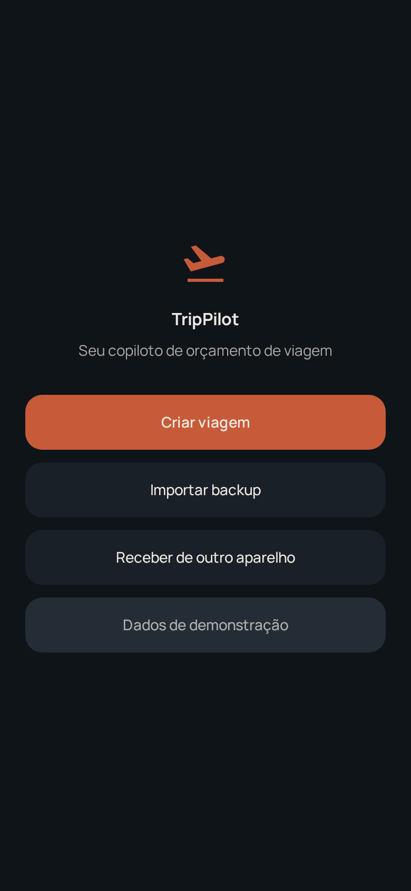
- **W-1 (P2):** botão "Dados de demonstração" parece desabilitado (contraste). **Técnica:** dar a ele o mesmo peso de botão secundário (borda/`surface-container`), texto ≥`on-surface-dim` legível.
- **W-2 (P3):** muito espaço vazio no topo; a proposta de valor ("seu copiloto de orçamento") poderia ganhar 1 linha de benefício concreto. **Técnica:** *value-first empty state*.
- **Anti-regressão:** as 4 portas (criar/importar/receber/demo) são corretas — não reduzir.

### 7.2 Dashboard (Início)
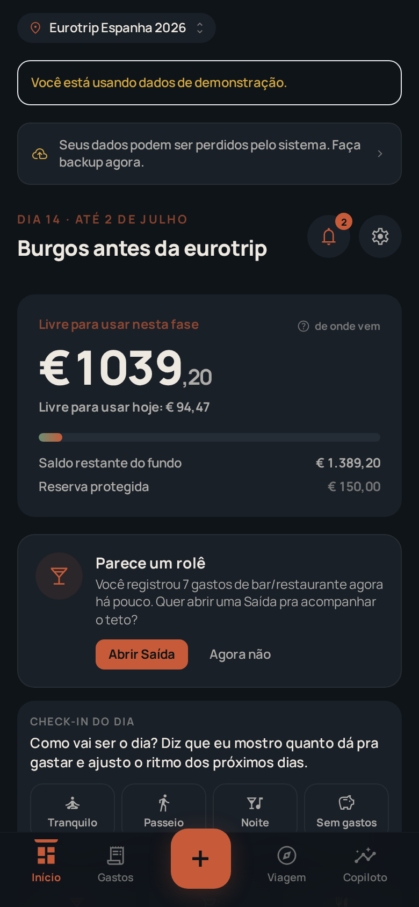
- **D-1 (P1):** **dois banners de alerta empilhados** ("Você está usando dados de demonstração" + "Seus dados podem ser perdidos pelo sistema. Faça backup agora.") empurram o herói pra baixo e geram ansiedade logo na abertura. **Técnica:** *notification consolidation* + *progressive disclosure* — no modo demo, suprimir o aviso de backup (não há o que perder); fora do demo, transformar o aviso em **1 chip discreto** que só vira banner quando há risco real. (NN/g: priorizar; mostrar o essencial.)
- **D-2 (P2):** o topo pede **3–4 decisões juntas** (trocar viagem, ler alerta, check-in, "Abrir Saída"). **Técnica:** *one primary action per view* — eleger 1 ação primária por estado e rebaixar o resto.
- **D-3 (P2):** overlines em `faint`/small-caps (DIA 14, CHECK-IN DO DIA) com baixo contraste. **Técnica:** subir token `faint` (ver B).
- **Anti-regressão:** o **número-herói** ("Livre para usar nesta fase / hoje"), o "de onde vem" e o tom do nudge são excelentes — manter.

### 7.3 FAB / Ações rápidas
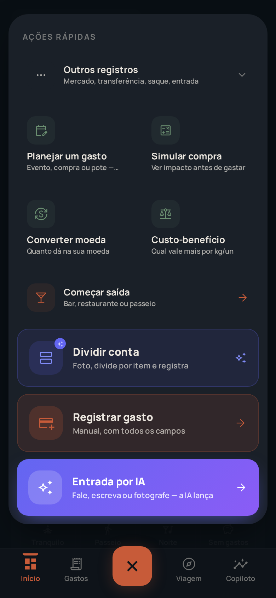
- **F-1 (P2):** **~9 ações** num só menu. **Material 3 recomenda 3–6 e diz explicitamente: acima de 6, use outro componente** (speed dials não rolam). O Round 1 já reorganizou (DEC-226, "ÂNCORA 9") com chunking + expanders — bom — mas o teto continua estourado.
- **F-2 (P2):** **3 cards grandes competem** pelo papel de "caminho primário" (azul "Dividir conta", terracota "Registrar gasto", roxo "Entrada por IA"), cada um com tratamento visual diferente. Qual é O caminho? **Técnica:** *visual hierarchy* — eleger **1 herói** (provavelmente "Entrada por IA", que já é o mais chamativo), rebaixar os outros a linhas consistentes; agrupar por natureza (Capturar / Planejar / Ferramentas). (NN/g: "chunk advanced features into groups".)
- **Comparador V1** ("Custo-benefício") está **bem colocado** na grade de ferramentas. ✅
- **Anti-regressão:** decisão do Julio de **manter as 9** é legítima (velocidade > pureza); o pedido aqui é **hierarquia**, não remoção.

### 7.4 Gastos (Expenses)
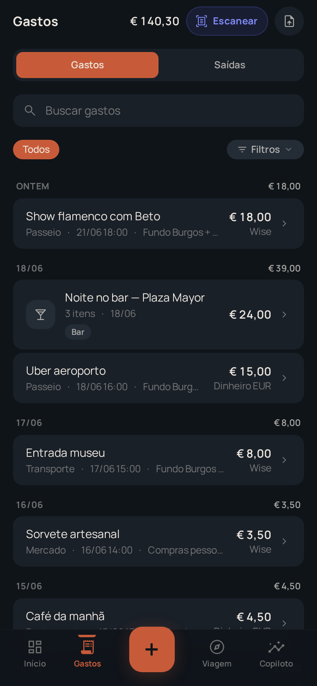
- **G-1 (P1/P2):** metadados (categoria · hora · fundo · método) em `faint` **e truncados** ("Fundo Burgos + …"). Perde informação e legibilidade. **Técnica:** subir contraste (B) + priorizar 2 metadados e mover o resto para o detalhe.
- **G-2 (P2):** "Escanear" usa **acento azul/índigo** enquanto tudo é terracota — primeira aparição da **família de acento de IA** sem explicação (ver E).
- **Anti-regressão:** agrupamento por data + totais por dia + método de pagamento + `tabular-nums` = ótima arquitetura de informação.

### 7.5 Viagem (Hub do plano)
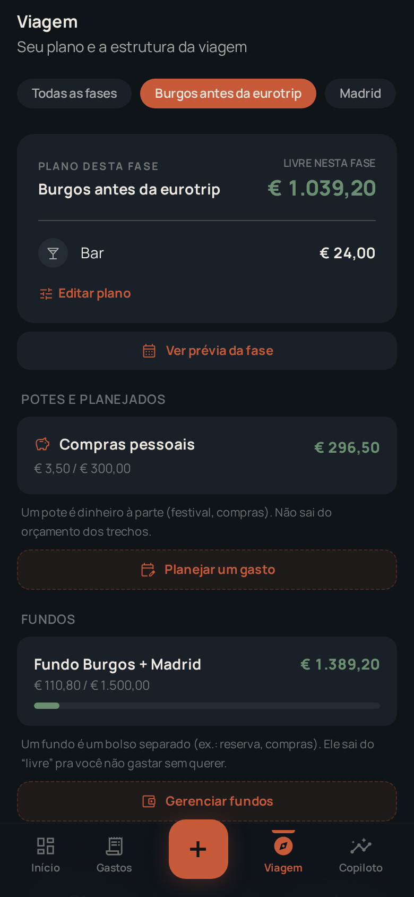
- **V-1 (P1):** densidade de **conceitos de dinheiro** numa tela (fase, livre, pote, fundo, alocado). **Técnica:** as definições inline já existem (ótimo) — falta **consistência de vocabulário** e talvez um *glossário* acessível por toque (1 toque → "o que é um fundo?").
- **V-2 (P2, herdado G7 do Round 1):** sobreposição entre `/viagem` (Hub) e `/trip` (Overview)/`/trip/edit`/`/funds`/`/planner`. **Técnica:** consolidar para **1 mapa + 1 editor**.
- **Anti-regressão:** os cartões de pote/fundo com barra de progresso e descrição são claros — manter o padrão.

### 7.6 Planejador (Cenários)
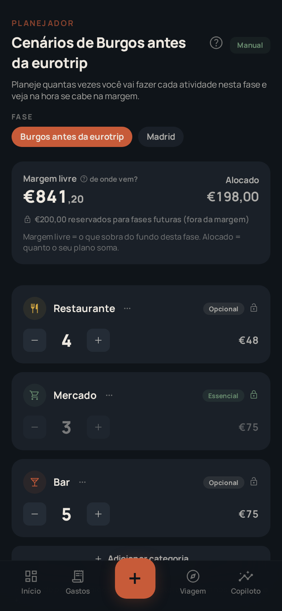
- **P-1 (P2):** tags **"Opcional/Essencial" + cadeado** sem affordance; steppers cinza parecem desabilitados sem explicar por quê. **Técnica:** microcopy/tooltip de 1 linha + estado desabilitado com motivo ("bloqueado: essencial").
- **P-2 (P3):** pílula "Manual" no header sem rótulo de contexto. **Técnica:** rótulo claro ("Modo: manual").
- **Anti-regressão:** o **stepper "quantas vezes × cabe na margem"** é uma ótima metáfora concreta — manter.

### 7.7 Copiloto
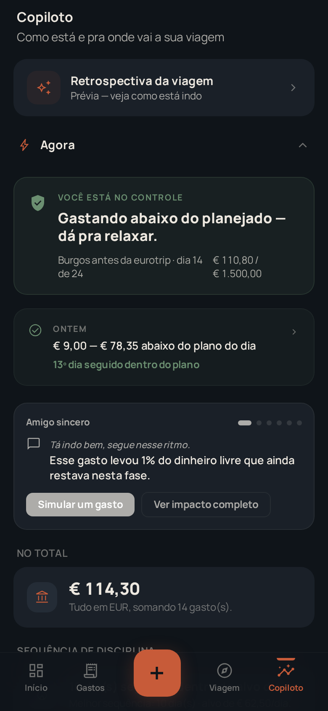
- **C-1 (P2, herdado G3):** "parede de cards" — muitos módulos de insight empilhados (Retrospectiva, Agora, Ontem, Amigo sincero, No total, Sequência de disciplina…). **Técnica:** *progressive disclosure* — mostrar 2–3 insights-chave + "ver mais"; o carrossel do "Amigo sincero" já é um bom padrão.
- **Anti-regressão:** o tom ("Você está no controle"), streaks e o "Amigo sincero" são o coração emocional do app — **intocáveis**.

### 7.8 Conversor & Comparador (ferramentas)
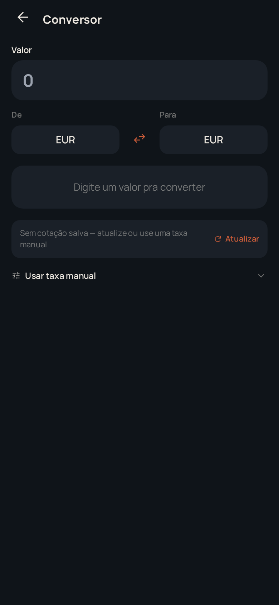 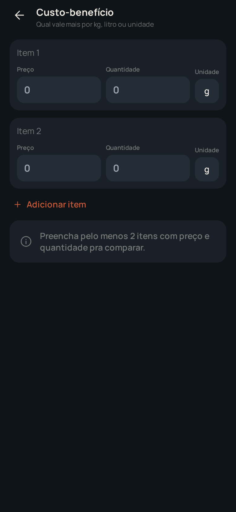
- **T-1 (P3):** Conversor abre com **De=EUR / Para=EUR** (converter para a mesma moeda). **Técnica:** default inteligente (Para = moeda de casa do usuário).
- **T-2 (P3):** campos com placeholder "0" em `faint` parecem preenchidos com zero. **Técnica:** placeholder mais claro ("ex.: 2,50") + contraste.
- **Comparador V1** está limpo, consistente com o Conversor, com hint de estado vazio. ✅ (Evolução em `comparator-v2-multi-image-plan-2026-06-22.md`.)

### 7.9 Configurações / Guia / Ajuda
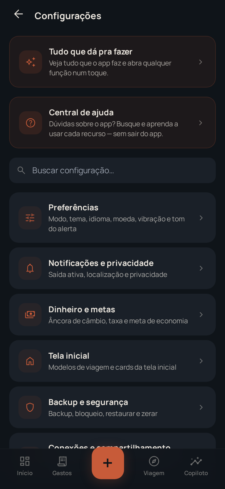 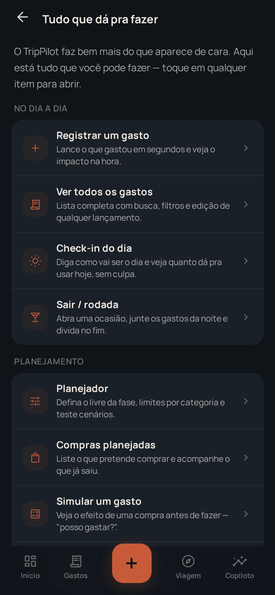 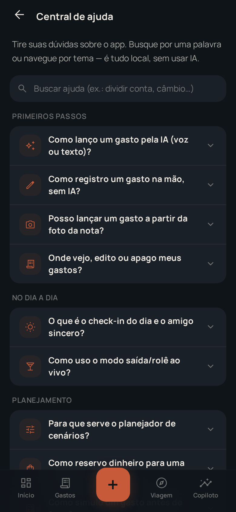
- **Quase nada a corrigir.** IA agrupada, subtítulos descritivos, busca, e dois atalhos promovidos (Guia + Ajuda). **Este trio é o modelo de clareza do app** — use-o como referência para as outras áreas. (P3: revisar contraste de overlines.)

---

## 8. Achados transversais (atualização do G1–G9 + novos)

| Cód. | Tema | Status vs Round 1 | Severidade |
|---|---|---|:---:|
| **G1** Sobrecarga de vocabulário | **Persiste** (mitigado por defs inline + Guia) | P1 |
| **G2** Fricção na captura | **Melhorou** (QuickAdd com disclosure; entrada IA) | P2 |
| **G3** Parede de cards (Copiloto/Home) | **Persiste** | P2 |
| **G4** FAB sobrecarregado | **Reorganizado** (DEC-226), mas ainda >6 ações | P2 |
| **G5** Descoberta | **Resolvido em grande parte** pelo Guia/Ajuda | ✅/P3 |
| **G7** Duas superfícies de "viagem" | **Persiste** | P2 |
| **N1 (novo)** **Foco de teclado ausente** | Não estava no Round 1 | **P1** |
| **N2 (novo)** **Contraste AA de texto pequeno/CTA** | Não medido no Round 1 | **P1** |
| **N3 (novo)** **Acento de IA (índigo/violeta) não tokenizado/documentado** | Novo | P2 |
| **N4 (novo)** **Estado ativo só por cor (nav)** | Novo | P2 |
| **N5 (novo)** **`transition: all` em 8 arquivos** (anti-padrão do próprio design-system) | Novo | P3 |

---

## 9. Conselho estratégico (inline, nesta sessão — 1 request, sem subagentes)

_Modo: `/council` · 4 perspectivas (Estrategista, Arquiteto, Crítico, Advogado). Cada voz escrita às cegas a partir do Brief; síntese só no fim._

### Decision Brief (neutro)
**Pergunta:** diante do pedido "menos confuso, mais sleek e funcional", qual deve ser a **estratégia de UX da próxima rodada** — e **onde investir primeiro**? Fatos verificados: app v0.99.49, ~30 rotas, 85 telas; heurística 31/40 ("Bom"); **zero P0**; achados dominantes = densidade/vocabulário + 2 lacunas de a11y baratas (foco, contraste). Já existe modo simples/completo, Guia e Ajuda. Decisão prévia do dono: **não remover capacidade** (ÂNCORA 9 do FAB). **Viés do chat a resistir:** a palavra "menos confuso" pode empurrar para **simplificar removendo** — o que contradiz o valor central (riqueza) e a decisão do dono. Resistir também ao oposto (defender o status quo só porque "está bom").

### Perspectivas (às cegas)
**Estrategista** — O diferencial do TripPilot é ser um *copiloto rico* (orçamento por fase, pote, fundo, IA, divisão, saídas). Competir em "simplicidade" contra apps minimalistas é perder o que o torna especial. O movimento certo é **"clareza progressiva", não amputação**: investir em hierarquia e onboarding conceitual para que a riqueza **revele-se no ritmo do usuário**. Primeiro investimento: o **dashboard** (primeira tela, maior alavanca de percepção de "sleek"). · **Rec:** clareza > simplicidade. · **Confiança:** ALTA · **Outros perdem:** remover features destruiria o fosso competitivo.

**Arquiteto** — Tecnicamente, os maiores ganhos por real investido são as **lacunas de a11y/tema** (1 regra `:focus-visible`, 2–3 tokens de contraste, tokenizar o acento de IA). São globais: corrigem dezenas de telas de uma vez, sem risco de regressão de produto. Densidade é mais cara e arriscada (mexe em layout). **Sequência:** primeiro o transversal barato (tokens/foco), depois densidade tela a tela. · **Rec:** transversal-barato primeiro. · **Confiança:** ALTA · **Outros perdem:** sem foco/contraste, qualquer "sleek" novo nasce com dívida.

**Crítico** — O risco real não é o usuário "não conseguir" — é o **primeiro minuto**: abrir e levar 2 banners de medo + avalanche de jargão. Isso fica caro em **abandono**, não em suporte. A falha de foco/contraste é AA — defensável adiar num app pessoal, mas é **prova de que falta uma passada de a11y**. Atacar o **onboarding emocional/cognitivo** (banners, vocabulário) tem o maior retorno percebido. · **Rec:** primeiro o "primeiro minuto". · **Confiança:** MÉDIA · **Outros perdem:** métricas de retenção, não de tarefa.

**Advogado (usuário)** — O usuário **ama** o tom, os streaks, o "Amigo sincero", a entrada por IA. Ele não pediu menos — pediu **mais fácil de ler**. As menores frustrações reais são **legibilidade** (texto apagado, metadados truncados) e **"o que clico primeiro?"**. Resolver isso já entrega 80% do "sleek". · **Rec:** legibilidade + 1 ação primária por tela. · **Confiança:** ALTA · **Outros perdem:** a beleza atual já é alta; o gargalo é leitura, não estética.

### Red Team (matar a opção líder)
A opção líder ("transversal-barato + dashboard primeiro") pode **mascarar** o problema real: tokens mais legíveis deixam o app mais bonito, mas **não reduzem a quantidade de decisões** no topo do dashboard nem o número de conceitos. Risco de "polir o convés" e o usuário continuar perdido no **modelo mental de dinheiro**. Contra-ataque: por isso a densidade do dashboard e o **onboarding conceitual** (não só visual) precisam entrar **junto**, não depois.

### Síntese (Chair)
- **Consenso:** **clareza, não amputação.** Ninguém recomenda remover capacidade. Todos convergem que o ganho está em **legibilidade + hierarquia + primeiro minuto**.
- **Tensões:** Arquiteto quer **transversal-barato primeiro** (baixo risco); Crítico quer **primeiro minuto primeiro** (maior retorno percebido). Estrategista/Advogado: começar pelo **dashboard**.
- **Recomendação (lente que pesa mais aqui = Advogado + Arquiteto):** rodar **dois pacotes em paralelo**, porque atacam riscos diferentes e não colidem:
  1. **Pacote "Legibilidade & A11y" (transversal, barato, baixo risco):** `:focus-visible` global; ajustar tokens `faint`/terracota/erro; `aria-current` + reforço não-cromático na nav; tokenizar e **documentar** o acento de IA; trocar `transition: all`. → conserta dezenas de telas, zero risco de produto.
  2. **Pacote "Primeiro Minuto" (dashboard + onboarding):** consolidar/condicionar os banners; **1 ação primária por estado** no dashboard; hierarquia do FAB (1 herói + grupos); semente de **onboarding conceitual** (glossário por toque dos termos de dinheiro).
- **Condições:** preservar tom, streaks, Amigo sincero, Guia/Ajuda, e a ÂNCORA-9 do FAB (hierarquia, não remoção).
- **O que mudaria a recomendação:** se houver dado de **abandono no onboarding**, o "Primeiro Minuto" vira prioridade única; se o alvo for publicar como app "acessível" (loja/637 etc.), a a11y sobe para P0.
- **Confiança geral:** **ALTA** — os dois pacotes são de baixo risco e alta legibilidade; a única incerteza é a ordem, não o conteúdo.

---

## 10. Roadmap priorizado (matéria-prima dos próximos pacotes)

> Sem P0. Agrupado para casar com o fluxo de "pacotes" do projeto. Cada item tem técnica + custo estimado.

### Pacote UX-A — "Legibilidade & A11y" (transversal · baixo risco · alto alcance)
| ID | Ação | WCAG/Fonte | Custo |
|---|---|---|---|
| A-1 (P1) | Regra global **`:focus-visible`** (anel `--primary`/`--glow`, respeitando tema) | 2.4.7 | XS |
| A-2 (P1) | Ajustar tokens: subir alpha de `--on-surface-faint` (mirar ≥4.5:1); CTA terracota → texto branco puro **ou** escurecer `--primary` ~6% | 1.4.3 | S |
| A-3 (P2) | `aria-current="page"` na aba ativa + reforço não-cromático (peso/indicador) | 1.4.1 / 4.1.2 | XS |
| A-4 (P2) | **Tokenizar** o acento de IA (`--ai`, `--ai-2`) e **documentar** no design-system; validar contraste no tema claro | 1.4.3 | S |
| A-5 (P3) | Trocar `transition: all` por propriedades específicas (8 arquivos) | perf/anti-padrão | S |

### Pacote UX-B — "Primeiro Minuto" (dashboard + onboarding · médio risco)
| ID | Ação | Técnica/Fonte | Custo |
|---|---|---|---|
| B-1 (P1) | Consolidar/condicionar banners do topo (suprimir backup no demo; chip discreto fora dele) | notification consolidation (NN/g) | S |
| B-2 (P2) | **1 ação primária por estado** no dashboard; rebaixar secundárias | one primary action | M |
| B-3 (P2) | Hierarquia do FAB: 1 herói + grupos (Capturar/Planejar/Ferramentas) | Material 3 (3–6) + chunking (NN/g) | M |
| B-4 (P1) | Onboarding **conceitual**: glossário por toque dos termos de dinheiro (fase/pote/fundo/margem) | progressive/contextual disclosure | M |

### Pacote UX-C — "Polimento por área" (P2/P3 · incremental)
- C-1 Botão demo legível (W-1) · C-2 affordance de Opcional/Essencial+cadeado (P-1) · C-3 metadados de Gastos (G-1) · C-4 defaults do Conversor (T-1) · C-5 consolidar `/viagem`×`/trip` (G7) · C-6 reduzir "parede" do Copiloto (G3).

---

## 11. Catálogo de técnicas (com fonte) a aplicar

- **Progressive / contextual disclosure** — mostrar o essencial; revelar o avançado sob demanda; **máx. 2 níveis**; gatilhos contextuais em vez de tutorial front-loaded. *(NN/g; IxDF, 2026; LogRocket.)*
- **Working memory ≤4** (Miller/Cowan) — ≤4 opções por ponto de decisão; ≤5 itens de nav. *(skill `critique`/cognitive-load.)*
- **One primary action per view** — 1 primária, 1–2 secundárias, resto em menu. *(cognitive-load.)*
- **Material 3 FAB** — speed dial/menu = **3–6 ações**; acima disso, outro componente; rótulo + ícone; alvo ≥48dp. *(m3.material.io.)*
- **WCAG 2.2 AA** — texto 4.5:1 (3:1 grande), UI/foco 3:1 (1.4.11), foco visível (2.4.7), cor não-sozinha (1.4.1), alvo 24px (2.5.8). *(W3C Quickref.)*
- **Notification consolidation** — agrupar/priorizar avisos; alerta só quando há risco real. *(NN/g priorização.)*
- **Value-first empty states** — estado vazio que ensina/converte em vez de só informar.

---

## 12. O que NÃO consegui verificar (honestidade)

- **Tema claro:** medições de contraste foram no **tema escuro** (primário). O tema claro existe nos tokens mas não foi medido — as cores **hard-coded** (terracota-alpha, índigo de IA) **não herdam** o tema, então o tema claro precisa de uma passada própria. (MÉDIA)
- **Leitor de tela real (NVDA/VoiceOver):** inferido por código (semântica/ARIA), não testado com SR real. (MÉDIA)
- **Estados de erro forçados** (rede caída, OCR falhando, DB corrompido): vi os componentes (`DataErrorScreen`, recuperação), não forcei todos. (MÉDIA)
- **Performance sob dados reais grandes** (centenas de gastos): demo é moderada; não medi long-lists/jank. (BAIXA)
- **Daemon do browser MCP** não subiu no WSL; por isso usei **Playwright direto** (Chromium real) — evidência equivalente, só registrando o caminho.

---

## 13. Referências
- W3C — *How to Meet WCAG 2.2 (Quickref)* — 1.4.1, 1.4.3, 1.4.11, 2.4.7, 2.5.8.
- Material Design 3 — *Floating Action Button* (speed dial 3–6).
- Nielsen Norman Group — *Progressive Disclosure*; IxDF — *Progressive Disclosure (2026)*; LogRocket — tipos/casos.
- Internos: `ux-clarity-audit-2026-06-17.md` (Round 1), `design-system.md`, skills `audit`/`critique`.
- Evidência: `./assets/ux-audit-2026-06-22/*.png` (15 telas) + medições em §3.

---

> **Próximo passo sugerido:** transformar **Pacote UX-A** (legibilidade & a11y) num pacote de entrega — é o de maior alcance por menor risco/custo, e prepara o terreno "sleek" para o Pacote UX-B.
